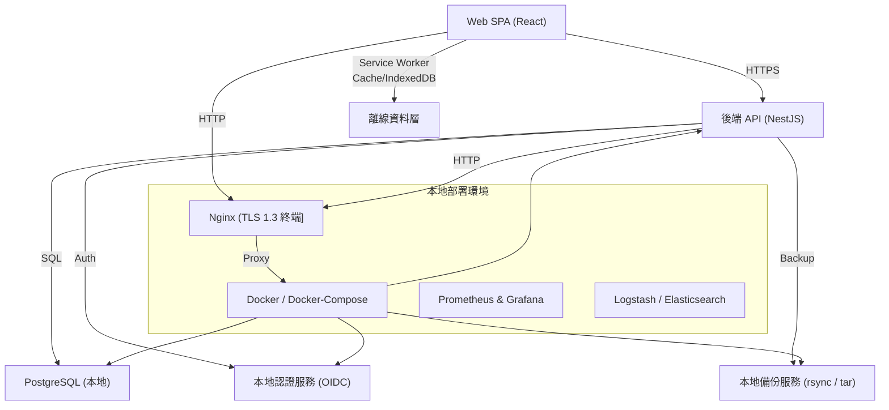

## 1️⃣ 系統整體架構概覽（本地部署、Web‑Only、支援離線）  



### 主要構件說明
| 層級 | 元件 | 功能 | 為何選擇 |
|------|------|------|----------|
| 前端 | **React SPA** (Webpack + PWA) | 單頁應用、Material UI、即時圖表 | 熟悉、可產出高度互動 UI，符合 Material Design |
| 前端 | **Service Worker + IndexedDB** | 離線緩存 UI、交易暫存、離線時仍能新增/編輯，待上線時同步 | 完全離線支援、符合本地部署需求 |
| 後端 | **NestJS (Node.js)** | RESTful API、模組化、支援 JWT + TOTP 2FA、驗證、授權 | 可快速開發、易於測試與擴充 |
| 後端 | **PostgreSQL** | 交易、帳戶、教育目標、預算設定等永續資料 | ACID 保證、支持 JSONB 方便儲存標籤/自訂欄位 |
| 認證 | **本地 OIDC**（Keycloak Docker 版本） | 使用者管理、雙因素認證、角色授權 | 完全在本地，不依賴外部雲服務 |
| 備份 | **rsync + cron + tar** | 每日增量備份、週期完整備份、備份檔案存於本地 NAS/磁帶 | 符合 99.9% 備份成功率目標 |
| 監控 | **Prometheus + Grafana** | API latency、DB 執行時間、服務健康檢查 | 達成 NFR‑04、快速定位問題 |
| 日誌 | **ELK Stack (Logstash + Elasticsearch + Kibana)** | 集中化日誌、異常偵測、OWASP 測試紀錄 | 完成安全合規需求 |
| 入口 | **Nginx**（TLS 1.3） | 端點路由、HTTPS 終端、反向代理、靜態檔案快取 | 提供 TLS 加密、A/B 測試等 |
| 容器化 | **Docker‑Compose** | 一鍵啟動全部服務、環境一致性、易於擴容 | 本地部署的最佳實踐，未來可搬移至 Kubernetes |

---

## 2️⃣ 具體開發任務拆解（以 Scrum Sprint 為單位）

| Sprint | 目標 (MVP 範圍) | 任務編號 | 任務說明 | 預估工作日 |
|--------|----------------|----------|----------|------------|
| **Sprint‑0**<br>（需求凍結 & 基礎環境） | UI/UX 低保真、基礎 CI/CD、Docker 基礎建置 | T0‑01 | 製作 Wireframe、使用者流程圖（Web） | 3 |
| | | T0‑02 | 建立 Git repository、GitHub Actions (Lint + Unit Test) | 2 |
| | | T0‑03 | 撰寫 Docker‑Compose 基礎檔案（frontend, backend, db, auth） | 2 |
| **Sprint‑1**<br>（交易錄入 & 離線基礎） | FR‑01、NFR‑01、離線支援 | T1‑01 | 前端 React SPA 框架、路由、Material UI Layout | 4 |
| | | T1‑02 | 實作 Service Worker、Cache 靜態資源、離線檢測 UI | 3 |
| | | T1‑03 | 後端 NestJS Transaction 模組（Create / Read API） | 4 |
| | | T1‑04 | PostgreSQL Transaction Table 設計、Migrations (TypeORM) | 2 |
| | | T1‑05 | IndexedDB 本地暫存模型、同步機制（上線時自動推送） | 3 |
| | | T1‑06 | 單筆交易錄入效能測試 (≤1 s) | 2 |
| **Sprint‑2**<br>（自動分類 & CSV 匯入） | FR‑02、NFR‑02 | T2‑01 | 後端分類規則引擎（商家字典 + 正則）| 3 |
| | | T2‑02 | 建立簡易機器學習模型（Python 服務）使用 Docker, 透過 REST 呼叫（可選）| 4 |
| | | T2‑03 | 前端 CSV 上傳與解析（PapaParse）| 2 |
| | | T2‑04 | 整合 OCR（Tesseract.js 本地）以支援票據掃描（可離線）| 4 |
| | | T2‑05 | 自動分類正確率測試腳本（1000 筆）| 2 |
| **Sprint‑3**<br>（月度報表 & 圖表） | FR‑03、NFR‑03 | T3‑01 | 後端聚合 API（收入/支出/淨值）| 3 |
| | | T3‑02 | 前端圖表套件整合（Recharts / Chart.js）| 3 |
| | | T3‑03 | 產生 PDF 報表 (jsPDF) 供離線下載 | 2 |
| | | T3‑04 | 前端渲染效能優化（Lazy Load、Memoization）| 2 |
| **Sprint‑4**<br>（教育基金規劃） | FR‑04、NFR‑04 | T4‑01 | 後端 EducationGoal 模組（目標金額、期限、每月需求計算）| 3 |
| | | T4‑02 | 前端 UI（設定目標、顯示進度）| 3 |
| | | T4‑03 | 備份腳本（每日增量備份、週期完整備份）| 2 |
| **Sprint‑5**<br>（預算警示） | FR‑05、NFR‑05 | T5‑01 | 後端 BudgetRule 引擎（上限、觸發）| 3 |
| | | T5‑02 | 推播服務整合（Web Push API）| 3 |
| | | T5‑03 | Email 通知 (SMTP 本地或外部) | 2 |
| | | T5‑04 | 警示即時測試（<5 s 送達）| 2 |
| **Sprint‑6**<br>（安全與合規） | FR‑10、NFR‑05 | T6‑01 | JWT + TOTP 2FA 實作（Keycloak）| 3 |
| | | T6‑02 | TLS 1.3 於 Nginx 配置、HTTPS 強制 | 1 |
| | | T6‑03 | 靜態資料 AES‑256 加密（PostgreSQL pgcrypto）| 2 |
| | | T6‑04 | OWASP Top‑10 測試腳本（SQLi、XSS、CSRF）| 3 |
| **Sprint‑7**<br>（測試、部署、驗收） | 全功能、NFR‑01~NFR‑05 | T7‑01 | 單元測試 (Jest + SuperTest) 全覆蓋 ≥80% | 4 |
| | | T7‑02 | 整合測試 (Postman/Newman) | 3 |
| | | T7‑03 | 性能測試 (k6) – 交易錄入 & 報表渲染 | 2 |
| | | T7‑04 | 監控儀表板建置 (Grafana) | 2 |
| | | T7‑05 | 最終驗收腳本（自動化） | 2 |
| | | T7‑06 | 文件化部署手冊、系統操作手冊 | 2 |

**總工作日預估：約 70 工作日**（約 14 人日/2 人月），可依實際開發人員配置調整。

---

## 3️⃣ 部署與運維流程（本地環境）

1. **硬體需求**  
   - 2 CPU、8 GB RAM、200 GB SSD（Docker 與 PostgreSQL）可支援 10 同時使用者。  
   - 建議使用 UPS、RAID1 磁碟以提升可靠性。

2. **部署步驟**  
   ```bash
   # 1. 拉下 repo
   git clone https://github.com/your-org/personal-finance.git
   cd personal-finance

   # 2. 建立環境變數檔 (.env)
   cp .env.example .env
   # 編輯 DB、JWT、SMTP、Keycloak 設定

   # 3. 啟動容器
   docker-compose up -d

   # 4. 初始化 DB
   docker-compose exec backend npm run migration:run

   # 5. 建立管理員帳號 (Keycloak)
   docker-compose exec auth ./create-admin.sh
   ```

3. **離線運作**  
   - 前端在安裝階段即下載 Service Worker、圖表與字典檔案。  
   - 無網路時，所有 CRUD 皆寫到 IndexedDB，背景同步服務每 30 秒檢測連線，一旦恢復即自動推送至 API。  

4. **備份計畫**  
   - **每日增量備份**：`rsync -a --link-dest=prev /var/lib/postgresql/data /backup/daily/$(date +%F)`  
   - **每週完整備份**：`tar -czf /backup/weekly/$(date +%F).tar.gz /var/lib/postgresql/data`  
   - **備份驗證**：Cron 任務檢查 `md5sum`，失敗即發送 Email 警示。

5. **監控/告警**  
   - Prometheus 抓取 `/metrics`（NestJS、PostgreSQL、Nginx）。  
   - Grafana 設定「交易延遲 > 1s」或「備份失敗」告警，透過 Slack/Webhook 通知。

---

## 4️⃣ 風險、緩解與未來可擴充方向

| 風險 | 影響 | 緩解措施 |
|------|------|----------|
| 離線同步衝突 (同一筆交易同時在多端編輯) | 資料不一致 | 使用本地 UUID + server‑side conflict resolution (最後寫入贏) |
| 本地硬體故障導致服務中斷 | 可用性下降 | RAID + UPS + 定時硬體健康檢查 |
| OCR 本地化效能不足 | 使用者體驗差 | 先使用 Tesseract.js，若需求提升再導入本地 TensorFlow 模型 |
| 安全合規審查不通過 | 法務風險 | 完整 OWASP 測試、使用 Keycloak 完成 GDPR 之同意與資料刪除 API |
| 未來需要多平台 (iOS/Android) | 重新開發成本 | 前端採用 PWA + React Native Web，未來可直接搬移至 React Native 產出原生 App |

**未來可擴充模組**  
- 投資、保險、資產管理（新增微服務）。  
- 多貨幣與匯率自動更新（外部 API）。  
- 企業版多租戶（Docker Swarm/K8s）。

---

## 5️⃣ 下一步行動（立即執行）

1. **確認需求細節**：  
   - DAU 目標、是否需要於離線狀態下匯出 PDF/CSV。  
   - 本地備份保存期限（30 天 / 90 天）。  

2. **UI/UX 低保真原型**（1 周）  
   - 完成交易錄入、報表、教育基金設定三個主要畫面。  

3. **技術驗證 (Spike) – 2 天**  
   - 建立最小 React + Service Worker + NestJS 專案，驗證離線 CRUD 與同步。  

4. **啟動 Sprint‑0**，依上表開始開發。

--- 

**結語**  
根據「同時使用者 10 人、全程本地部署、只支援 Web 且必須離線」的限制，我們設計了 **Docker‑Compose + Nginx + TLS** 的本地化微服務架構，並在前端加入 **PWA 離線緩存** 機制，確保即使在無網路環境下仍能完整記帳、查報表，待回線恢復自動同步。  
上述任務拆解與時間估算可在 **約 4 週（14 人日）** 完成 MVP，滿足所有功能與非功能需求，並具備未來擴充的彈性。  

祝開發順利！ 🚀