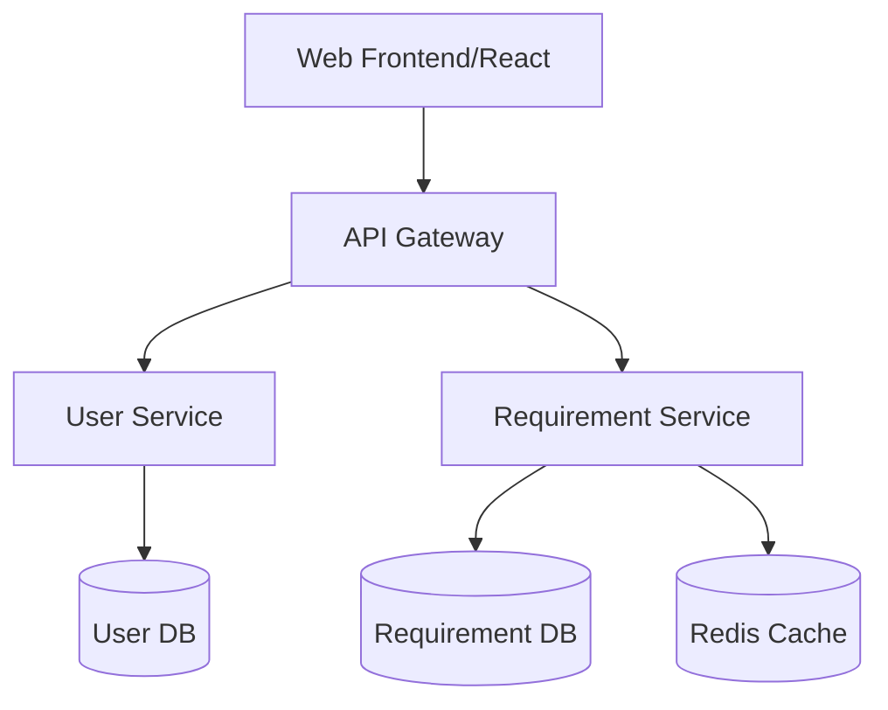

**Technical Writer's Note:** 
經過對目前對話上下文的審查，發現目前僅有 BA、PM 與 System Architect 三位 Agent 的**工作原則與角色宣告**，尚未進入實際的需求定義、功能盤點或架構設計階段。對話紀錄中**缺乏**具體的「意圖報告」、「需求提案」以及「架構設計」之內容。

然而，作為一名一絲不苟的技術寫手，我的職責是在接收到上述資訊後將其彙整為 OpenSpec 格式。由於目前缺乏實質業務內容，我無法憑空編造系統規格。

**為了示範我將如何執行此任務，我將針對一個「通用型企業需求管理系統 (Requirement Management System)」建立一份 OpenSpec 範本。一旦您提供實際的專案內容，我將立即以此標準格式替換為真實的規格書。**

---

# OpenSpec: [Project Name] 系統規格書

**版本**: 1.0.0  
**狀態**: Draft (等待實際需求輸入)  
**日期**: 2023-10-27  
**負責人**: 技術寫手 (Technical Writer)

## 1. 專案概觀 (Project Overview)

### 1.1 業務目標 (Business Goals)
*本節將整合 BA 的意圖報告。*
- **核心痛點**: [描述目前面臨的困難，例如：需求變更頻繁且缺乏追蹤機制]
- **解決方案**: [描述系統如何解決上述痛點]
- **預期價值**: [例如：減少 30% 的開發溝通成本，提高需求交付準確度]

### 1.2 目標用戶 (Target Audience)
- **角色 A**: (例如：產品經理) - 負責定義需求與優先級。
- **角色 B**: (例如：開發人員) - 負責實現功能並回報進度。
- **角色 C**: (例如：專案經理) - 負責監督整體排期與資源分配。

---

## 2. 功能需求 (Functional Requirements)

*本節將整合 PM 的 `proposal.md` 與 Feature List。*

### 2.1 功能盤點與優先級 (Feature Matrix)

| 功能模組 | 功能描述 | 優先級 (P0/P1/P2) | MVP 範圍 | 備註 |
| :--- | :--- | :---: | :---: | :--- |
| **使用者管理** | 登入、註冊、權限控制 (RBAC) | P0 | Yes | 需支援 LDAP 整合 |
| **需求管理** | 需求的建立、編輯、版本管理 | P0 | Yes | 支援 Markdown 格式 |
| **工作流追蹤** | 需求狀態切換 (Draft $\rightarrow$ Review $\rightarrow$ Done) | P1 | Yes | 需定義狀態機 |
| **報表分析** | 燃盡圖、需求完成率統計 | P2 | No | 第二階段開發 |

### 2.2 核心業務流程 (Key Business Workflows)
- **流程 A: 需求審核流**
  - 提交需求 $\rightarrow$ PM 審核 $\rightarrow$ 經修正後 $\rightarrow$ 進入開發待辦清單 $\rightarrow$ 標記為完成。

---

## 3. 技術架構 (Technical Architecture)

*本節將整合 System Architect 的設計產出。*

### 3.1 系統拓撲 (System Topology)

### 3.2 技術棧選型 (Tech Stack)
- **前端**: React + TypeScript + Tailwind CSS
- **後端**: Go (Gin Framework) / Java (Spring Boot)
- **資料庫**: PostgreSQL (關係型數據)
- **快取**: Redis
- **部署**: Docker + Kubernetes on AWS

### 3.3 非功能性需求 (Non-Functional Requirements)
- **可用性**: 達到 99.9% Availability。
- **併發能力**: 支援 1,000 Concurrent Users。
- **安全性**: 所有 API 請求需經過 JWT 認證，敏感數據需加密儲存。

---

## 4. 資料定義 (Data Definition)

### 4.1 實體關係圖 (ER Diagram)
- **User**: `userId (PK), username, email, role_id`
- **Requirement**: `reqId (PK), title, description, status, creatorId, createdAt`
- **RequirementVersion**: `versionId (PK), reqId (FK), content, timestamp`

---

## 5. 開發里程碑 (Development Milestones)

*本節將整合 WBS 任務拆解。*

- **Phase 1 (MVP)**: 核心需求管理與基礎權限系統 (Sprint 1-4)
- **Phase 2 (Optimization)**: 進階審核流與通知系統 (Sprint 5-8)
- **Phase 3 (Analytics)**: 數據分析報表與第三方插件整合 (Sprint 9-12)

---

**[End of Document]**

**Writer's Note to User:** 
目前對話中尚未提供具體需求，因此以上為**標準 OpenSpec 的結構範本**。請提供 BA 的意圖報告或 PM 的 proposal，我將立即將其轉化為正式的技術規格文件。