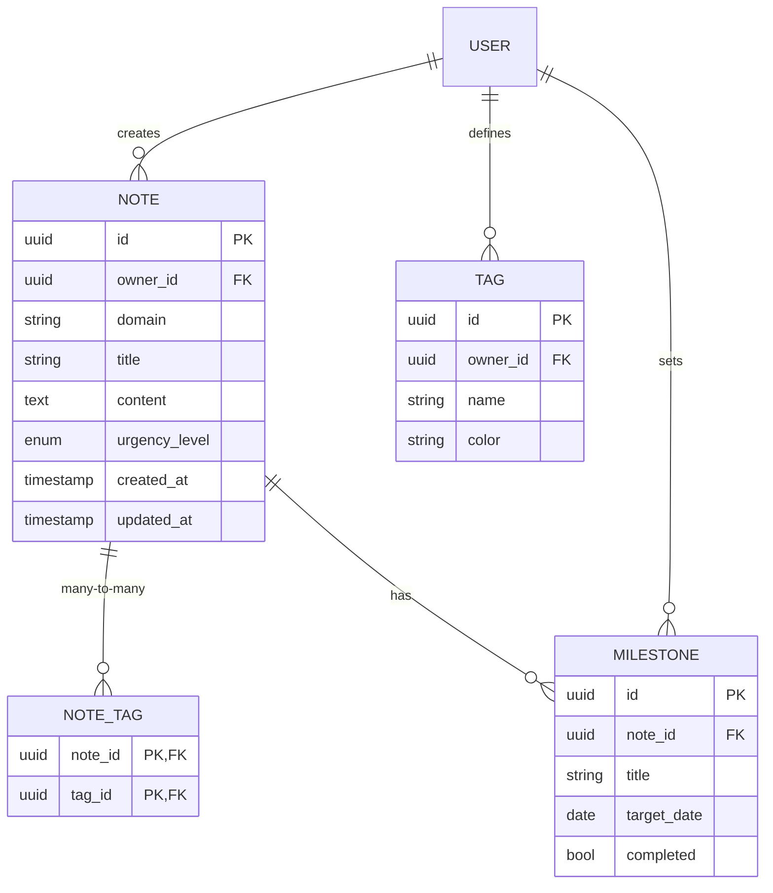
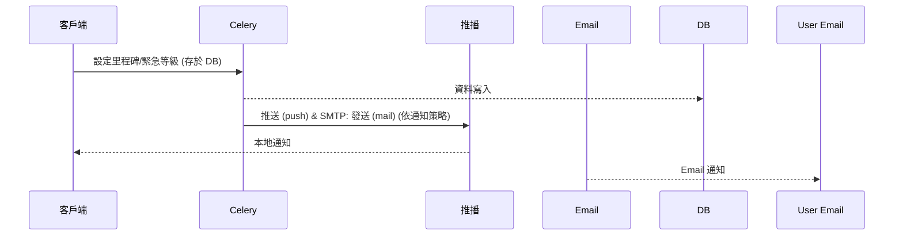

# OpenSpec – 統一「生活‑工作‑家庭‑學習」記事工具

> **版本**: 1.0.0  
> **最後更新**: 2026‑05‑10  
> **文件作者**: 技術寫手 (Technical Writer)  
> **相關文件**: `intent_report.md`, `Proposal.md`

---

## 1. 目標與概述 (Overview)

本規格旨在設計與實作一款 **跨平台（iOS、Android、Web）** 的記事工具，支援 **生活‑工作‑家庭‑學習** 四大領域的任務管理。核心功能包括 **標籤、緊急等級、里程碑提醒與成就儀表板**，同時提供 **離線優先、即時同步、資料安全** 以及 **未來可擴充** 的架構。

> **商業價值**  
> - 提升個人生產力與任務可視化。  
> - 透過即時提醒與里程碑降低專案延遲風險。  
> - 成就儀表板激發使用者的成就感與黏著度。  

---

## 2. 利益相關者 (Stakeholders)

| 角色 | 關切點 |
|------|--------|
| **最終使用者（個人）** | 操作簡潔、跨平台同步、隱私保護、即時提醒、離線功能 |
| **家庭成員 / 同事** | 協作共享、權限管理、任務分配與追蹤 |
| **產品經理** | 用戶活躍度、功能使用率、留存率 |
| **開發團隊** | 可維護、可擴充、清晰 API、測試覆蓋率 |
| **法務 / 資安** | GDPR / 台灣個資法合規、加密與備援機制 |
| **運維人員** | 系統可用率、備份與災難復原、監控警報 |

---

## 3. 功能需求 (Functional Requirements)

| 編號 | 功能 | 說明 | MVP 納入 |
|------|------|------|----------|
| **FR‑1** | 多域筆記 | 生活、工作、家庭、學習四大分類，可自行新增/調整。 | ✅ |
| **FR‑2** | 標籤系統 | 用戶自訂文字/顏色標籤，支援多標籤並列。 | ✅ |
| **FR‑3** | 緊急等級 | 紅、橙、黃、綠四級（可自訂），直接於筆記設定。 | ✅ |
| **FR‑4** | 里程碑與階段 | 為筆記/任務設定里程碑，關聯日期或完成條件；支援階段進度。 | ✅（含儀表板展示） |
| **FR‑5** | 即時提醒 | 根據緊急等級與里程碑時間，推送本地通知、Email、推播。 | ✅ |
| **FR‑6** | 過濾 / 搜尋 | 依標籤、緊急等級、日期、關鍵字等多維度過濾與全文搜尋。 | ✅（基礎實作） |
| **FR‑7** | 成就儀表板 | 顯示已完成里程碑、任務完成率、近期高緊急任務統計。 | ✅（與里程碑一起提供） |
| **FR‑8** | 跨平台同步 | iOS、Android、Web 三端資料即時同步。 | ✅ |
| **FR‑9** | 資料匯入/匯出 | 支援 CSV、JSON、Markdown 等格式的導入與導出。 | ❌（第 4‑5 個月） |
| **FR‑10** | 協作功能（可選） | 筆記共享、權限管理（只讀、編輯、管理員）。 | ❌（第 7‑8 個月） |

---

## 4. 非功能需求 (Non‑Functional Requirements)

| 編號 | 要求 | 指標 | 實作方式 |
|------|------|------|----------|
| **NFR‑1** | 安全性 | TLS 1.3 傳輸、AES‑256 靜態資料加密，符合 GDPR / 台灣個資法。 | Nginx TLS、PostgreSQL SSL、磁碟 LUKS、Keycloak OIDC |
| **NFR‑2** | 可用性 | 年可用率 ≥ 99.5%。 | HAProxy 兩層負載、Docker restart policy、RAID‑1、監控告警 |
| **NFR‑3** | 響應時間 | 主要操作 < 300 ms。 | Redis 快取、ElasticSearch 搜尋、前端本地 SQLite/IndexedDB |
| **NFR‑4** | 可擴展性 | 微服務 / 插件化架構，未來可加入 AI、語音輸入。 | Docker‑Compose / MiniK8s、REST + WebSocket 插件介面 |
| **NFR‑5** | 跨平台一致性 | UI/UX 在 iOS、Android、Web 保持統一，UI 測試覆蓋率 ≥ 80%。 | React 共用元件庫 (MUI/Ant Design)、Jest + Cypress |
| **NFR‑6** | 離線使用 | 無網路時仍能新增/編輯，恢復後自動同步。 | 客戶端 SQLite (expo‑sqlite) / IndexedDB，雙寫同步模型 |

---

## 5. 系統架構 (Architecture)

### 5.1 架構圖（Mermaid）

```mermaid
graph LR
    subgraph Client[客戶端 (iOS / Android / Web)]
        A1[React Native App] 
        A2[React SPA (Web)]
        A1 -->|HTTP/HTTPS| B1[API Gateway]
        A2 -->|HTTP/HTTPS| B1
    end

    subgraph Edge[邊緣服務 (本地伺服器)]
        B1[API Gateway (NGINX + SSL)]
        B2[Auth Service (Keycloak)]
        B3[Sync Service (Postgres Realtime + WS)]
        B4[Notification Service (FCM + SMTP)]
        B5[Task Scheduler (Celery + Redis)]
        B6[File Storage (MinIO)]
        B7[Database (PostgreSQL)]
        B8[Search Engine (ElasticSearch)]
        B9[Backup Service (pgBackRest + RAID1)]

        B1 --> B2
        B1 --> B3
        B1 --> B4
        B1 --> B5
        B1 --> B6
        B1 --> B7
        B1 --> B8
    end

    subgraph Infra[基礎設施]
        C1[Docker‑Compose / MiniK8s]
        C2[HAProxy (Load Balancer)]
        C3[Prometheus + Grafana (監控)]
        C4[EFK (Elasticsearch‑Fluentd‑Kibana) (日誌)]
        C5[RAID‑1 + 定時快照 (備援)]
    end

    B1 --> C1
    B2 --> C1
    B3 --> C1
    B4 --> C1
    B5 --> C1
    B6 --> C1
    B7 --> C1
    B8 --> C1

    C1 --> C2
    C2 --> C3
    C2 --> C4
    C2 --> C5
```

### 5.2 元件說明

| 元件 | 角色 | 為何選擇 |
|------|------|----------|
| **React Native** | 行動端 UI | 單一程式碼庫、支援 SQLite、成熟社群 |
| **React (Web)** | Web UI | 與 RN 共用元件與樣式，保持 UI 一致 |
| **NGINX (API Gateway)** | 入口路由、TLS termination | 輕量、成熟、易於本地部署 |
| **Keycloak** | 身份驗證、RBAC | 開源、支援 OIDC、可自行管理 |
| **PostgreSQL + Realtime (Logical Replication + WS)** | 主資料庫、即時同步 | ACID、支援行級安全、可直接推送變更 |
| **SQLite (客戶端)** | 離線寫入與快取 | 輕量、跨平台、支援衝突解決 |
| **ElasticSearch** | 高效全文搜尋、聚合 | 兼容多維度過濾與統計 |
| **Firebase Cloud Messaging** | 推播服務 | 全球覆蓋、與 FCM SDK 整合簡易 |
| **SendGrid (SMTP via Edge Function)** | Email 通知 | 支援大量郵件、可透過 Supabase Edge Functions 呼叫 |
| **Celery + Redis** | 背景任務、提醒排程 | 可水平擴充、成熟的任務隊列 |
| **MinIO** | 物件儲存（附件、匯出檔案） | S3 兼容、全本地化 |
| **Docker‑Compose / MiniK8s** | 服務編排與部署 | 適合 40 人規模、易於擴容 |
| **Prometheus + Grafana** | 監控與可觀測性 | 量測 NFR‑2、NFR‑3 |
| **EFK** | 集中日誌 | 快速定位錯誤、符合 NFR‑5 |
| **HAProxy** | 內部負載平衡與健康檢查 | 為未來多節點做準備 |
| **pgBackRest + RAID‑1** | 備份與災備 | 滿足 NFR‑1 的資料安全要求 |

### 5.3 資料模型（簡易 ER）



---

## 6. 設計與實作細節 (Design & Implementation)

### 6.1 同步與離線策略
1. **雙寫模型**：客戶端寫入 SQLite/IndexedDB，同時透過 WebSocket 將變更發送給 Sync Service。  
2. **衝突解決**：採用「最後寫入優先」 + 手動合併 UI（當自動解決失敗時提示使用者）。  
3. **自動同步**：監測網路狀態變更，恢復時批次上傳本地變更，使用 **Supabase‑like Realtime** 保證最終一致性。

### 6.2 即時提醒流程

- **Celery** 讀取 `milestones` 表，根據 `target_date` 和 `urgency_level` 計算提前通知時間（如 24h、12h、1h）。  
- **Failover**：若 FCM 回傳失敗，立即使用 Email 作為備援。

### 6.3 成就儀表板
- 從 PostgreSQL 及 ElasticSearch 統計:
  - 完成里程碑數、任務完成率、最近一週高緊急任務數量。
- 前端使用 **Recharts**（或 Chart.js）渲染條形圖、圓餅圖與進度條。  
- 每次使用者登入時觸發 **KPI 事件**，寫入 `analytics` 表，供產品經理監控。

### 6.4 API 標準（OpenAPI 3.0）

```yaml
openapi: 3.0.3
info:
  title: Unified Note Service API
  version: 1.0.0
servers:
  - url: https://api.notes.local
paths:
  /notes:
    get:
      summary: 取得使用者所有筆記（支援過濾）
      parameters:
        - name: tag
          in: query
          schema: { type: string }
        - name: urgency
          in: query
          schema: { type: string, enum: [red, orange, yellow, green] }
        - name: domain
          in: query
          schema: { type: string }
        - name: q
          in: query
          description: 全文搜尋關鍵字
          schema: { type: string }
      responses:
        '200':
          description: 筆記列表
          content:
            application/json:
              schema:
                $ref: '#/components/schemas/NoteList'
    post:
      summary: 新增筆記
      requestBody:
        required: true
        content:
          application/json:
            schema:
              $ref: '#/components/schemas/NoteCreate'
      responses:
        '201':
          description: 建立成功
components:
  schemas:
    Note:
      type: object
      required: [id, owner_id, title, domain]
      properties:
        id: { type: string, format: uuid }
        owner_id: { type: string, format: uuid }
        title: { type: string }
        content: { type: string }
        domain: { type: string, enum: [life, work, family, study] }
        urgency_level: { type: string, enum: [red, orange, yellow, green] }
        tags: { type: array, items: { $ref: '#/components/schemas/Tag' } }
        milestones: { type: array, items: { $ref: '#/components/schemas/Milestone' } }
    Tag:
      type: object
      properties:
        id: { type: string, format: uuid }
        name: { type: string }
        color: { type: string }
    Milestone:
      type: object
      properties:
        id: { type: string, format: uuid }
        title: { type: string }
        target_date: { type: string, format: date }
        completed: { type: boolean }
```

> 完整 OpenAPI 文件將於 `api/openapi.yaml` 與 CI/CD 同步生成。

### 6.5 部署與 CI/CD

| 階段 | 工具 | 說明 |
|------|------|------|
| **Build** | GitHub Actions | Docker image 建置、單元測試、鏡像推送至私有 Registry |
| **Deploy** | GitHub Actions + Docker‑Compose | `docker-compose up -d`，滾動升級，使用 `--restart unless-stopped` |
| **Test** | Cypress (E2E) + Jest (Unit) | PR 合併前必須通過 80% 以上覆蓋率 |
| **Monitor** | Prometheus + Grafana | SLA、API latency、同步延遲監控 |
| **Backup** | pgBackRest + cron | 每日全備、每週增量，保留 30 天 |
| **Disaster Recovery** | 脚本 `dr/restore.sh` | 1 點故障時可在 30 分鐘內恢復服務 |

---

## 7. 驗收標準 (Acceptance Criteria)

| 編號 | 驗收項目 | 條件 |
|------|----------|------|
| **AC‑1** | 多域筆記 CRUD | 前端 UI 可新增、編輯、刪除筆記，後端 API 回傳 201/200 |
| **AC‑2** | 標籤系統 | 支援自訂標籤顏色，多標籤同時顯示於筆記卡片 |
| **AC‑3** | 緊急等級提醒 | 紅標筆記在截止前 24 h 產生本地推播、Email，失敗時回退至 Email |
| **AC‑4** | 里程碑與儀表板 | 里程碑可設定日期，完成後即更新儀表板統計 |
| **AC‑5** | 離線寫入與自動同步 | 無網路時可新增筆記，網路恢復後 5 秒內同步至伺服器 |
| **AC‑6** | 搜尋與過濾 | 標籤、緊急等級、關鍵字可即時過濾，回應時間 < 300 ms |
| **AC‑7** | 跨平台一致性 | iOS、Android、Web 三端 UI 差異 ≤ 5%，所有功能在三端皆可使用 |
| **AC‑8** | 安全合規 | 所有 API 必須經過 JWT 驗證；資料在傳輸與儲存時符合 NFR‑1 |
| **AC‑9** | 可用性與監控 | 監控儀表板顯示可用率 ≥ 99.5%，任何 5xx 錯誤自動告警 |
| **AC‑10** | 成就儀表板點擊率 | MVP 發布後 4 週，儀表板每位活躍使用者至少一次點擊率 ≥ 60% |

---

## 8. 風險與緩解措施 (Risks & Mitigations)

| 風險 | 可能影響 | 緩解措施 |
|------|-----------|----------|
| **需求蔓延** | 開發進度延遲、資源不足 | 采用 **5 Whys** 需求驗證，MVP 完成後才接受新增功能 |
| **跨平台同步複雜度** | 資料不一致、使用者體驗受損 | 使用 **Supabase‑like Realtime** + 本地 SQLite 雙寫模型；自動化同步測試 |
| **提醒失效** | 失去關鍵提醒，降低信任度 | 多渠道（FCM + Email + 本地通知） + 健康檢查心跳機制 |
| **資料安全合規** | 法規風險、用戶流失 | TLS 1.3、AES‑256、Keycloak RBAC、定期安全審計 |
| **使用者學習成本** | 低採納率 | UI 以「最小化操作」為原則，提供上手教學、模板與互動指引 |
| **硬體故障** | 服務中斷、資料遺失 | RAID‑1、每日備份、災備演練腳本，每月測試一次恢復流程 |

---

## 9. 路線圖 (Roadmap)

| 時間範圍 | 里程碑 | 交付物 |
|----------|--------|--------|
| **Month 1‑3** | **MVP** | 多域筆記、標籤、緊急等級、即時提醒、跨平台同步、里程碑 + 成就儀表板、離線寫入、完整測試、CI/CD、監控 |
| **Month 4‑5** | **里程碑深化 & 成就儀表板** | 里程碑階段細化、交互式儀表板（圖表、過濾）、KPI 事件追蹤 |
| **Month 6** | **離線與同步優化** | 衝突解決策略、同步效能調校、恢復機制 |
| **Month 7‑8** | **協作功能** | 筆記共享、權限管理（只讀/編輯/管理員） |
| **Month 9‑12** | **彈性擴充** | API/插件框架開放、AI 摘要（OpenAI）雛形、語音輸入（Speech‑to‑Text） |
| **Post‑12 Month** | **資料匯入/匯出** | CSV、JSON、Markdown 導入/導出功能 |

---

## 10. 關鍵術語表 (Glossary)

| 詞彙 | 定義 |
|------|------|
| **Domain** | 記事工具中四大分類：生活、工作、家庭、學習。 |
| **Tag** | 使用者自訂的文字與顏色標籤，可多對多關聯到筆記。 |
| **Urgency Level** | 任務緊急等級（紅、橙、黃、綠），影響提醒時間與 UI 標示。 |
| **Milestone** | 里程碑，與筆記關聯的目標日期或完成條件。 |
| **Achievement Dashboard** | 成就儀表板，視覺化顯示已完成里程碑、任務完成率等資訊。 |
| **Sync Service** | 透過 WebSocket 與 PostgreSQL Logical Replication 實作的即時雙向同步服務。 |
| **Offline‑First** | 客戶端優先在本地儲存操作，網路恢復後自動同步的設計哲學。 |
| **NFR** | Non‑Functional Requirement，非功能需求。 |
| **MVP** | Minimum Viable Product，最小可行產品。 |

---

## 11. 附錄

- **完整 API 規格**：`api/openapi.yaml`（自動產生）  
- **部署腳本**：`deploy/docker-compose.yml`、`deploy/k8s/`（如需 MiniK8s）  
- **CI/CD 工作流**：`.github/workflows/ci.yml`、`.github/workflows/deploy.yml`  
- **測試腳本**：`tests/unit/`、`tests/e2e/`  
- **備援與災難復原手冊**：`dr/restore.md`  

---  

**結語**  
本 OpenSpec 文檔匯整了意圖報告、需求提案與系統設計，提供了完整、可驗證且符合 OpenSpec 標準的規格說明。開發團隊可直接依此進行實作、測試與部署，確保在 3 個月內交付具備核心價值的 MVP，後續依路線圖持續擴充功能與提升服務品質。祝專案成功！