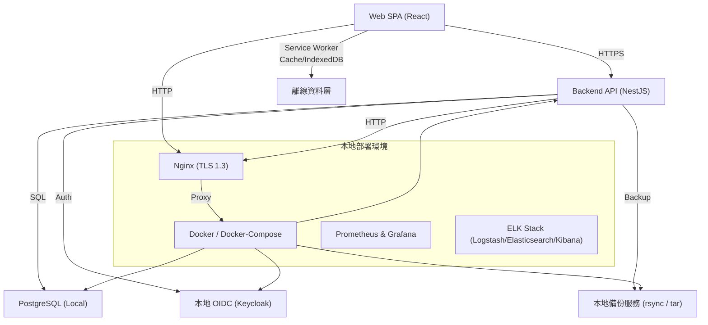

# OpenSpec – 個人記帳系統（Personal Finance Tracker）

**Document Version**: 1.0  
**Date**: 2026‑05‑10  
**Author**: 技術寫手 (Technical Writer)  

---  

## 1. 概要 (Overview)

本規格文件定義 **個人記帳系統** 的完整功能、非功能需求、系統架構與交付標準，旨在協助家庭使用者即時掌握收入、支出與資產變化，並提供教育基金規劃與預算警示，以降低超支風險、提升財務透明度與生活品質。

---

## 2. 目標與成功指標 (Goals & Success Metrics)

| 目標 | KPI | 測量方式 |
|------|-----|----------|
| 財務透明度 | 交易自動分類正確率 ≥ 95% | 1000 筆測試資料自動分類驗證 |
| 教育基金規劃 | 計算誤差 ≤ ±5% | 與手動計算結果比較 |
| 超支警示 | 警示觸發率 ≥ 80% 減少 | 警示頻率統計 |
| 使用者滿意度 | ≥ 4.5 / 5 | 使用者問卷 |
| 系統可用性 | 99.9% 備份成功率、99.5% 上線時間 | 監控報表 |

---

## 3. 利害關係人 (Stakeholders)

| 角色 | 需求 / 關注點 |
|------|----------------|
| 家長（主要使用者） | 精準財務視圖、教育資金規劃、即時警示 |
| 配偶 / 共同管理者 | 資料共享、同步更新 |
| 稅務 / 會計顧問 | 匯出標準化報表、資料完整性 |
| 開發團隊 | 明確需求、可測試交付、技術可擴充 |
| 法務 / 合規 | 個資保護、GDPR / 個資法遵循 |

---

## 4. 功能需求 (Functional Requirements)

| 編號 | 功能說明 | 重要性 |
|------|----------|--------|
| FR‑01 | **交易錄入**：手動輸入、CSV 匯入、手機相機票據掃描 | 必要 |
| FR‑02 | **自動分類**：依商家類別、關鍵字自動歸類（生活、教育、娛樂等） | 必要 |
| FR‑03 | **月度收支報表**：柱狀圖、餅圖呈現收入、支出、淨值變化 | 必要 |
| FR‑04 | **教育基金規劃**：設定目標金額、時程，系統自動計算每月所需儲蓄 | 高 |
| FR‑05 | **預算警示**：設定類別月度上限，超過即時推播 / Email 通知 | 高 |
| FR‑06 | **多帳戶匯總**：支援多個銀行、信用卡、現金帳戶統一視圖 | 中 |
| FR‑07 | **備份與同步**：雲端備份，跨裝置（手機/平板/PC）同步 | 必要 |
| FR‑08 | **匯出功能**：匯出 CSV、PDF 報表供會計或稅務使用 | 中 |
| FR‑09 | **使用者自訂類別與標籤**：允許自行新增/編輯分類與標籤 | 低 |
| FR‑10 | **安全與隱私**：雙因素認證、資料加密、GDPR / 個資法遵循 | 必要 |

---

## 5. 非功能需求 (Non‑Functional Requirements)

| 編號 | 項目 | 目標 |
|------|------|------|
| NFR‑01 | **效能** | 單筆交易錄入 ≤ 1 秒，報表渲染 ≤ 2 秒 |
| NFR‑02 | **可用性** | UI/UX 符合 Material Design，操作步驟 ≤ 3 步 |
| NFR‑03 | **可擴充性** | 模組化服務架構，未來可加入投資、保險等模組 |
| NFR‑04 | **可靠性** | 月度備份成功率 99.9%，系統正常運作時間 ≥ 99.5% |
| NFR‑05 | **安全性** | 資料傳輸 TLS 1.3，靜態資料 AES‑256 加密，雙因素認證 |
| NFR‑06 | **相容性** | iOS 13+、Android 8+、Web Chrome/Firefox/Safari |
| NFR‑07 | **國際化** | 支援多貨幣與繁體中文、英語兩種語系 |

---

## 6. 系統架構概覽 (System Architecture Overview)



### 主要構件說明

| 層級 | 元件 | 功能 |
|------|------|------|
| 前端 | **React SPA (PWA)** | Material UI、即時圖表、離線支援 |
| 前端 | **Service Worker + IndexedDB** | 離線緩存與交易暫存、回線恢復自動同步 |
| 後端 | **NestJS** | RESTful API、模組化、JWT + TOTP 驗證 |
| 後端 | **PostgreSQL** | 交易、帳戶、教育目標、預算設定之永續儲存 |
| 認證 | **Keycloak (Docker)** | OIDC、雙因素認證、角色授權 |
| 備份 | **rsync + cron + tar** | 每日增量、每週完整備份、支援 NAS |
| 監控 | **Prometheus + Grafana** | API latency、DB 執行時間、服務健康 |
| 日誌 | **ELK Stack** | 集中化日誌、異常偵測、OWASP 測試紀錄 |
| 入口 | **Nginx** | TLS 1.3 終端、HTTPS 強制、反向代理 |
| 容器化 | **Docker‑Compose** | 一鍵啟動全部服務、易於本地部署與未來搬遷至 Kubernetes |

---

## 7. 開發任務拆解 (Sprint‑Based Task Breakdown)

| Sprint | 目標 (MVP 範圍) | 任務編號 | 任務說明 | 預估工作日 |
|--------|----------------|----------|----------|------------|
| **Sprint‑0**<br>需求凍結 & 基礎建制 | UI/UX 低保真、CI/CD、Docker 基礎 | T0‑01 | 製作 Wireframe、使用者流程圖（Web） | 3 |
| | | T0‑02 | 建立 Git repo、GitHub Actions (Lint + Unit Test) | 2 |
| | | T0‑03 | 撰寫 Docker‑Compose 基礎檔案（frontend, backend, db, auth） | 2 |
| **Sprint‑1**<br>交易錄入 & 離線支援 | FR‑01、NFR‑01、離線基礎 | T1‑01 | 前端 React SPA 框架、路由、Material UI Layout | 4 |
| | | T1‑02 | Service Worker、Cache 靜態資源、離線偵測 UI | 3 |
| | | T1‑03 | NestJS Transaction 模組（Create / Read API） | 4 |
| | | T1‑04 | PostgreSQL Transaction Table 設計 & Migration (TypeORM) | 2 |
| | | T1‑05 | IndexedDB 本地暫存模型、同步機制（上線自動推送） | 3 |
| | | T1‑06 | 單筆交易錄入效能測試 (≤1 s) | 2 |
| **Sprint‑2**<br>自動分類 & CSV/票據匯入 | FR‑02、NFR‑02 | T2‑01 | 後端分類規則引擎（商家字典 + 正則） | 3 |
| | | T2‑02 | 簡易機器學習服務（Docker Python）供關鍵字預測 | 4 |
| | | T2‑03 | 前端 CSV 上傳與解析（PapaParse） | 2 |
| | | T2‑04 | 本地 OCR（Tesseract.js）支援票據掃描 | 4 |
| | | T2‑05 | 自動分類正確率測試腳本（1000 筆） | 2 |
| **Sprint‑3**<br>月度報表 & 圖表 | FR‑03、NFR‑03 | T3‑01 | 後端聚合 API（收入/支出/淨值） | 3 |
| | | T3‑02 | 前端圖表套件整合（Recharts） | 3 |
| | | T3‑03 | PDF 報表產出（jsPDF）供離線下載 | 2 |
| | | T3‑04 | 前端渲染效能優化（Lazy Load、Memoization） | 2 |
| **Sprint‑4**<br>教育基金規劃 | FR‑04、NFR‑04 | T4‑01 | 後端 EducationGoal 模組（目標金額、期限、每月需求計算） | 3 |
| | | T4‑02 | 前端 UI（設定目標、顯示進度） | 3 |
| | | T4‑03 | 備份腳本（每日增量、每週完整） | 2 |
| **Sprint‑5**<br>預算警示 | FR‑05、NFR‑05 | T5‑01 | 後端 BudgetRule 引擎（上限、觸發） | 3 |
| | | T5‑02 | Web Push API 整合推播服務 | 3 |
| | | T5‑03 | Email 通知（SMTP） | 2 |
| | | T5‑04 | 警示即時測試（<5 s 送達） | 2 |
| **Sprint‑6**<br>安全與合規 | FR‑10、NFR‑05 | T6‑01 | JWT + TOTP 2FA（Keycloak） | 3 |
| | | T6‑02 | Nginx TLS 1.3 配置、HTTPS 強制 | 1 |
| | | T6‑03 | 靜態資料 AES‑256 加密（pgcrypto） | 2 |
| | | T6‑04 | OWASP Top‑10 測試腳本（SQLi、XSS、CSRF 等） | 3 |
| **Sprint‑7**<br>測試、部署、驗收 | 全功能、NFR‑01~NFR‑05 | T7‑01 | 單元測試 (Jest + SuperTest) ≥ 80% 覆蓋率 | 4 |
| | | T7‑02 | 整合測試 (Postman/Newman) | 3 |
| | | T7‑03 | 性能測試 (k6) – 交易錄入 & 報表渲染 | 2 |
| | | T7‑04 | 監控儀表板建置 (Grafana) | 2 |
| | | T7‑05 | 最終驗收腳本（自動化） | 2 |
| | | T7‑06 | 部署手冊、使用者操作手冊 | 2 |
| **總計** |  |  | **≈ 70 工作日**（約 14 人日 / 2 人月） |

---

## 8. 部署與運維流程 (Local Deployment)

### 8.1 硬體需求
| 項目 | 規格 |
|------|------|
| CPU | 2 核心以上 |
| 記憶體 | 8 GB RAM |
| 儲存 | 200 GB SSD（Docker + PostgreSQL） |
| 網路 | 內部 LAN、HTTPS 端口 443 |
| 高可用 | UPS、RAID‑1、定時磁碟健康檢查 |

### 8.2 部署步驟

```bash
# 1️⃣ Clone repository
git clone https://github.com/your-org/personal-finance.git
cd personal-finance

# 2️⃣ 建立環境變數檔 (.env)
cp .env.example .env
# 編輯 DB、JWT、SMTP、Keycloak 設定

# 3️⃣ 啟動所有服務
docker-compose up -d

# 4️⃣ 初始化資料庫
docker-compose exec backend npm run migration:run

# 5️⃣ 建立管理員帳號 (Keycloak)
docker-compose exec auth ./create-admin.sh
```

### 8.3 離線運作機制
* 前端在首次載入時即下載 Service Worker、圖表與字典檔案。  
* 無網路時所有 CRUD 操作寫入 IndexedDB；背景同步服務每 30 秒檢測連線，一旦恢復即自動推送至 API。  
* 離線狀態下仍可產生 PDF 報表（jsPDF）供本機下載。

### 8.4 資料備份策略
| 類型 | 說明 | 預計頻率 |
|------|------|----------|
| 增量備份 | `rsync -a --link-dest=prev /var/lib/postgresql/data /backup/daily/$(date +%F)` | 每日 |
| 完整備份 | `tar -czf /backup/weekly/$(date +%F).tar.gz /var/lib/postgresql/data` | 每週 |
| 驗證 | `md5sum` 比對備份檔，失敗即 Email 警示 | 每次備份後 |

### 8.5 監控與告警
* **Prometheus** 抓取 `/metrics`（NestJS、PostgreSQL、Nginx）。  
* **Grafana** 設定「交易延遲 > 1 s」或「備份失敗」告警，透過 Slack / Email 通知。  
* **ELK** 用於安全日誌、OWASP 測試紀錄與異常偵測。

---

## 9. 測試與驗收標準 (Testing & Acceptance)

### 9.1 功能驗收
1. **FR‑01~FR‑05** 完全實作，遵循需求說明書測試通過。  
2. **自動分類** 正確率 ≥ 95%（1000 筆測試資料）。  
3. **預算警示** 超過上限 5 秒內推送至手機或 Email。

### 9.2 非功能驗收
| 項目 | 標準 |
|------|------|
| 效能 | 單筆交易錄入 ≤ 1 秒，月度報表渲染 ≤ 2 秒 |
| 可用性 | UI 操作步驟 ≤ 3 步，符合 Material Design |
| 可用率 | 系統上線時間 ≥ 99.5%，備份成功率 99.9% |
| 安全性 | TLS 1.3、AES‑256 加密、通過 OWASP Top‑10 測試 |

### 9.3 使用者驗收 (UAT)
* **20** 個家庭使用者第一次使用，平均完成記帳流程 < **2 分鐘**。  
* **使用者滿意度** ≥ **4.5 / 5**（問卷調查）。  

### 9.4 測試類型與工具
| 類型 | 工具 |
|------|------|
| 單元測試 | Jest + SuperTest |
| 整合測試 | Postman / Newman |
| 性能測試 | k6 |
| 安全測試 | OWASP ZAP、npm audit |
| 手機離線同步測試 | Chrome DevTools > Application > Service Workers |

---

## 10. 風險與緩解措施 (Risks & Mitigations)

| 風險 | 影響 | 緩解措施 |
|------|------|----------|
| OCR 辨識不準確 | 手動校正成本提升、使用者體驗下降 | 後端校驗規則、快速編輯介面；提供本地 fallback OCR 模型 |
| 多端同步衝突 | 資料不一致 | 本地 UUID + server‑side Conflict Resolution（最後寫入贏） |
| 硬體故障導致服務中斷 | 可用性下降 | RAID + UPS、定時硬體健康檢查、備份即時驗證 |
| 法規合規審查未通過 | 法務風險 | 完整 OWASP 測試、Keycloak 完成 GDPR 同意與資料刪除 API |
| 推播服務不穩定 | 警示即時性受損 | Firebase Cloud Messaging + Email 二次通知備援 |
| 開發團隊對 React Native 或 NestJS 不熟悉 | 交付時程延遲 | Sprint‑0 內部技術分享、PoC 驗證開發效率 |

### 未來可擴充方向
* **投資與保險模組**（新微服務）  
* **多貨幣與匯率自動更新**（外部匯率 API）  
* **企業版多租戶**（Kubernetes 部署）  

---

## 11. 路線圖 (Product Roadmap)

| 里程碑 | 時間 | 交付物 |
|--------|------|--------|
| 需求凍結 & UI/UX 低保真 | 第 1–2 週 | Wireframe、使用者流程圖 |
| 系統架構設計 | 第 3 週 | 高階架構圖、DB ERD、API 介面定義 |
| MVP 開發 Sprint‑1 | 第 4–6 週 | 手動與 CSV 錄入、基本自動分類、單筆錄入 ≤1s |
| MVP 開發 Sprint‑2 | 第 7–9 週 | 月度圖表、教育基金計算、備份/安全機制 |
| MVP 開發 Sprint‑3 | 第 10–11 週 | 預算警示推播/Email |
| 安全與合規 | 第 12–13 週 | 2FA、TLS、AES‑256、OWASP 測試 |
| 測試與驗收 | 第 14–15 週 | 單元、整合、性能、UAT |
| Beta 發布 & 用戶回饋 | 第 16 週 | 小規模家庭測試、收集 NPS |
| 正式上線 | 第 18 週 | 完整文件、支援渠道、運維交接 |

> **總開發時程約 4 個月（16 週）**，涵蓋所有 MVP 功能與核心非功能需求，具備未來擴充的彈性。

---

## 12. 文件附錄 (Appendices)

### 12.1 資料表概覽（簡化版）

| 表格 | 主要欄位 | 說明 |
|------|----------|------|
| users | id, email, password_hash, mfa_secret | 系統使用者與認證資訊 |
| accounts | id, user_id, type (bank/credit/cash), name, balance | 多帳戶資訊 |
| transactions | id, account_id, amount, date, merchant, category, tags, notes | 單筆交易 |
| categories | id, name, parent_id | 標準分類 (可自訂) |
| education_goals | id, user_id, target_amount, target_date, monthly_needed | 教育基金目標 |
| budgets | id, user_id, category_id, monthly_limit | 預算上限 |
| alerts | id, user_id, transaction_id, type, sent_at | 警示紀錄 |

### 12.2 API 介面示例（OpenAPI 3.0 片段）

```yaml
openapi: 3.0.3
info:
  title: Personal Finance Tracker API
  version: 1.0.0
servers:
  - url: https://api.personal-finance.local/v1
paths:
  /transactions:
    post:
      summary: 新增交易
      security:
        - bearerAuth: []
      requestBody:
        required: true
        content:
          application/json:
            schema:
              $ref: '#/components/schemas/TransactionCreate'
      responses:
        '201':
          description: 交易已建立
        '400':
          description: 輸入格式錯誤
  /reports/monthly:
    get:
      summary: 取得指定月份的收支報表
      parameters:
        - name: year
          in: query
          required: true
          schema:
            type: integer
            example: 2026
        - name: month
          in: query
          required: true
          schema:
            type: integer
            example: 5
      responses:
        '200':
          description: 報表資料
          content:
            application/json:
              schema:
                $ref: '#/components/schemas/MonthlyReport'
components:
  securitySchemes:
    bearerAuth:
      type: http
      scheme: bearer
      bearerFormat: JWT
  schemas:
    TransactionCreate:
      type: object
      required:
        - accountId
        - amount
        - date
        - merchant
      properties:
        accountId:
          type: string
          format: uuid
        amount:
          type: number
        date:
          type: string
          format: date
        merchant:
          type: string
        notes:
          type: string
        tags:
          type: array
          items:
            type: string
    MonthlyReport:
      type: object
      properties:
        income:
          type: number
        expense:
          type: number
        netWorth:
          type: number
        breakdown:
          type: array
          items:
            $ref: '#/components/schemas/CategoryBreakdown'
    CategoryBreakdown:
      type: object
      properties:
        category:
          type: string
        amount:
          type: number
``` 

### 12.3 用戶操作手冊（摘要）

1. **登入**：使用 Email + 密碼，首次登入後於設定頁面啟用 TOTP 2FA。  
2. **新增交易**：點擊「+」 → 輸入金額、商家、類別 → 點選「保存」 (≤1 s)。  
3. **匯入 CSV**：在「匯入」頁面上傳 CSV，系統自動解析並套用分類規則。  
4. **票據掃描**：開啟相機 → 拍照 → 系統使用本地 OCR 解析，產生交易草稿供手動確認。  
5. **查看月度報表**：點擊「報表」 → 選擇年月 → 看到柱狀圖、餅圖與淨值走勢。  
6. **設定教育基金**：於「教育基金」頁面輸入目標金額、完成日期，系統自動顯示每月需儲蓄金額。  
7. **預算警示**：在「預算」頁面為每個類別設定上限，超出時即收到推播或 Email。  
8. **備份 & 同步**：系統每日自動備份至本地 NAS，亦可於「設定」手動觸發備份。  

---  

## 13. 變更紀錄 (Change Log)

| 版次 | 日期 | 作者 | 變更說明 |
|------|------|------|-----------|
| 1.0 | 2026‑05‑10 | 技術寫手 | 首次撰寫完整 OpenSpec 文件，整合 Intent Report、Proposal、架構圖、任務拆解與驗收標準。 |

---  

**結語**  
此 OpenSpec 規格文件提供了完整的功能、非功能與部署藍圖，明確的里程碑與驗收標準確保本系統在 **即時財務可視化、教育基金規劃與預算警示** 三大核心需求上能快速交付、可靠運行，且具備未來功能擴充與多平台延伸的彈性。  

如需進一步調整需求優先度或技術選型，請於 **需求凍結會議** 中提出，文件將即時更新以保持一致。  

---  