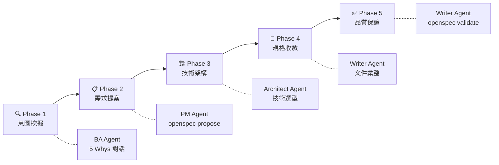
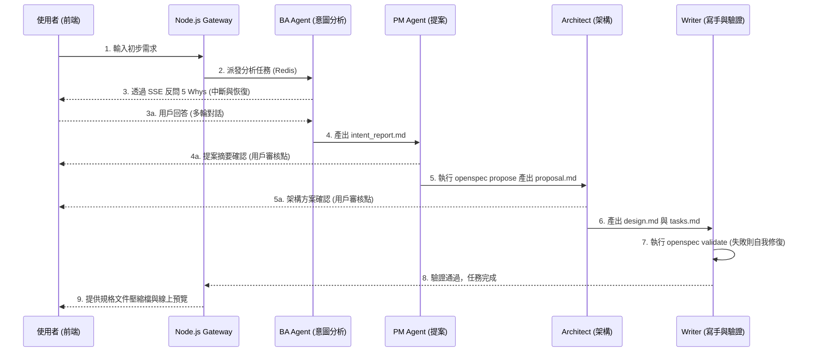
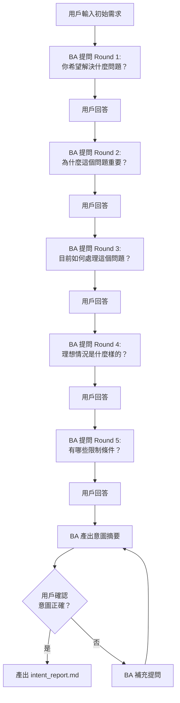
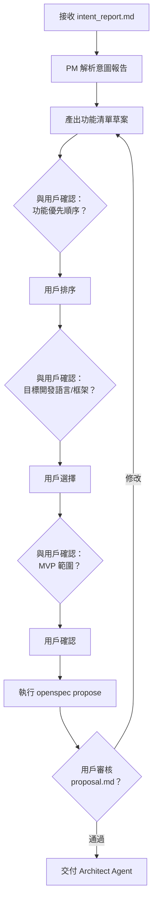
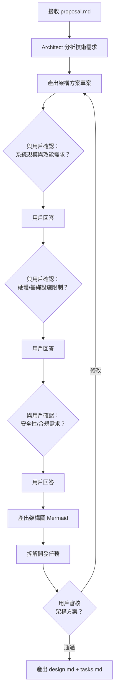
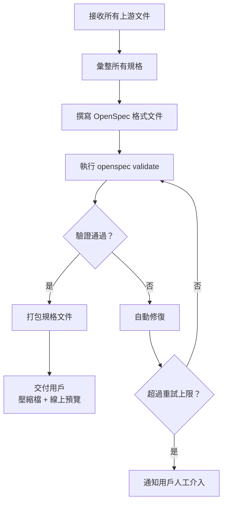
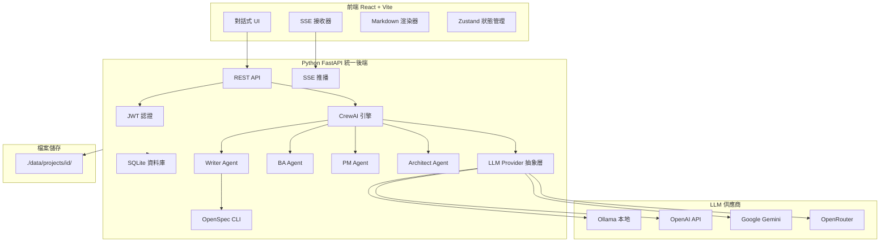
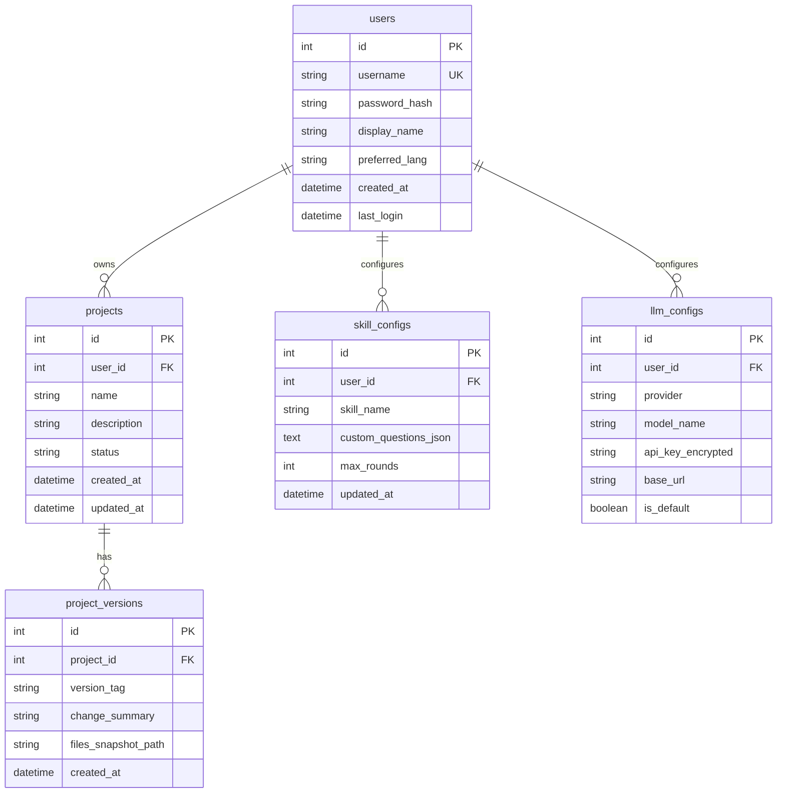
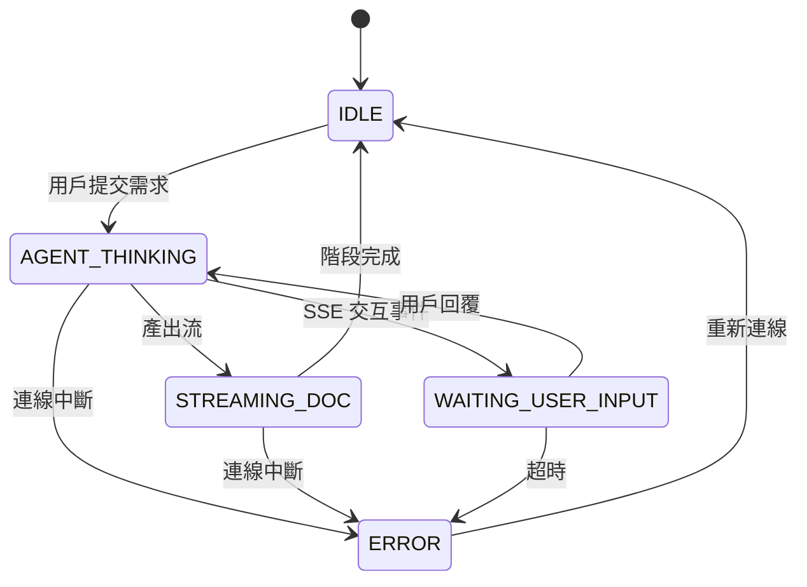

# SpecForge AI — 軟體開發需求規格書 (SRS v2.0)

> **專案名稱：** SpecForge AI（規格鍛造爐）
> **文件版本：** v2.1
> **日期：** 2026-05-02
> **狀態：** ✅ 已確認

---

## 1. 專案願景與目標

### 1.1 願景聲明

打造一個**智慧化 AI 軟體工程顧問平台**。系統透過多智能體（Multi-Agent）協作，以**對話式互動**主動挖掘使用者的真實商業意圖，最終產出符合 OpenSpec 規範的工業級規格文件。

### 1.2 核心價值主張

| 價值面向 | 說明 |
|---------|------|
| **防止 XY 問題** | BA Agent 透過 5 Whys 深層提問，避免使用者「提出解法而非問題」 |
| **規格即程式碼** | 產出物遵循 OpenSpec 的 `specs/` + `changes/` 結構，可版控、可驗證 |
| **全流程自動化** | 從意圖分析 → 提案 → 架構 → 規格撰寫 → 驗證，一條龍完成 |
| **人機協作** | 每個階段保留人工確認點，確保規格符合真實需求 |

### 1.3 目標使用者

- 有軟體開發需求但不具備撰寫技術規格能力的**產品擁有者 / 創業者**
- 需要快速產出標準化規格文件的**小型開發團隊**
- 想要導入 Spec-Driven Development 流程的**技術主管**

---

## 2. 系統核心流程 (The Pipeline)

### 2.1 五階段流水線



### 2.2 多智能體循序圖



---

## 3. 多智能體角色定義 (Agent Roles)

| 角色 | 職責 | 關鍵工具 | 產出檔案 |
|:-----|:-----|:---------|:---------|
| **BA (商業分析師)** | 挖掘需求意圖，防止 XY 問題，確認商業價值 | 5 Whys 思考框架 | `intent_report.md` |
| **PM (產品經理)** | 功能盤點、語言選擇確認、提案撰寫 | `openspec propose` | `proposal.md` |
| **Architect (架構師)** | 技術架構設計、任務分解、硬體環境評估 | Mermaid 繪圖、技術知識庫 | `design.md`, `tasks.md` |
| **Writer (技術寫手)** | 文件撰寫、格式標準化、驗證與修復 | `file_writer`, `openspec validate` | `specs/*.md` |

---

## 4. SKILL 技能包詳細規格（對答式確認）

> **設計原則：** 每個 SKILL 均設計為**與用戶對答確認**的模式。系統會透過結構化問題與用戶互動，確認開發意圖與邊界條件，避免誤解需求。

### SKILL-01：意圖挖掘（Intent Discovery）

**負責 Agent：** BA Agent

**對答流程：**


| 項目 | 規格 |
|------|------|
| **輸入** | 用戶的自然語言需求描述（支援中/英文） |
| **處理邏輯** | 採用 5 Whys 分析框架，逐層深掘需求根因 |
| **互動方式** | SSE 即時串流，支援多輪對話，支援中斷與恢復 |
| **終止條件** | 用戶確認意圖摘要正確 / 達到最大提問輪次（可配置，預設 7 輪） |
| **產出物** | `intent_report.md`（含痛點分析、商業價值、使用情境、約束條件） |

**啟動時確認問題：**
1. 「您希望 BA 以什麼語言與您互動？（繁體中文 / English）」
2. 「您的需求屬於哪個領域？（Web App / Mobile / API / 資料分析 / 其他）」
3. 「是否有已存在的系統需要整合？」

> **備註：** BA Agent 提問不固定為恰好 5 次，以「抵達根因」為目標動態調整。

---

### SKILL-02：需求提案（Requirement Proposal）

**負責 Agent：** PM Agent

**對答流程：**


| 項目 | 規格 |
|------|------|
| **輸入** | `intent_report.md` |
| **處理邏輯** | 解析意圖報告 → 功能盤點 → 用戶確認 → `openspec propose` |
| **互動方式** | 功能清單以卡片式呈現，用戶可拖拽排序優先級 |
| **產出物** | `proposal.md`（含功能清單、優先級、技術約束、開發語言建議） |

**確認問題範例：**
1. 「以下功能列表是否有遺漏或需調整？」
2. 「您偏好的技術棧？（React/Vue/純 HTML、Node.js/Python/Go）」
3. 「第一階段 MVP 包含哪些核心功能？」
4. 「部署環境偏好？（雲端 / 本地 / 混合）」

---

### SKILL-03：技術架構設計（Technical Design）

**負責 Agent：** Architect Agent

**對答流程：**


| 項目 | 規格 |
|------|------|
| **輸入** | `proposal.md` |
| **處理邏輯** | 技術選型分析 → 架構設計 → 任務拆解 → 用戶確認 |
| **互動方式** | 以 Mermaid 圖表呈現架構方案，支援用戶即時反饋 |
| **產出物** | `design.md`（系統架構圖、技術選型）、`tasks.md`（開發任務清單） |

**確認問題範例：**
1. 「預期的用戶量級？（10人 / 100人 / 1000+）」
2. 「是否需要即時通訊或推播功能？」
3. 「資料儲存有無特殊要求？（GDPR、資料落地等）」
4. 「是否有現有的 CI/CD 流程需要整合？」

---

### SKILL-04：規格撰寫與驗證（Spec Writing & Validation）

**負責 Agent：** Writer Agent

**處理流程：**


| 項目 | 規格 |
|------|------|
| **輸入** | `intent_report.md` + `proposal.md` + `design.md` + `tasks.md` |
| **處理邏輯** | 彙整 → 格式化 → 驗證 → 自動修復 → 交付 |
| **自動修復** | 驗證失敗時，Writer 解析錯誤訊息並自動調整文件（最多 3 次重試） |
| **產出物** | `specs/*.md`（完整 OpenSpec 規格文件集） |

---

## 5. 多智能體框架選型比較

> **背景：** 選擇正確的 Multi-Agent 框架是本專案最關鍵的技術決策之一。以下比較目前（2026）主流方案。

### 5.1 框架比較表

| 框架 | 核心抽象 | 適用場景 | 學習曲線 | 生產就緒度 |
|------|---------|---------|---------|-----------|
| **CrewAI** | 角色制團隊 | 結構化團隊工作流、快速原型 | ⭐ 低 | ⭐⭐⭐ 中高 |
| **LangGraph** | 狀態機圖 | 複雜狀態流、需嚴格控制分支 | ⭐⭐⭐ 高 | ⭐⭐⭐⭐ 高 |
| **AutoGen** | 對話式群組 | 研究型腦力激盪、多輪對話 | ⭐⭐ 中 | ⭐⭐ 中 |
| **Google ADK** | 階層式委派 | Google 生態整合、A2A 協定 | ⭐⭐ 中 | ⭐⭐⭐ 中高 |
| **Pi-Agent (極簡)** | 極簡 Hook 系統 | 單一 coding agent、CLI 工具 | ⭐ 低 | ⭐⭐ 中 |
| **Pi Agent (企業)** | 100+ 代理協作 | 企業級決策系統（供應鏈等） | ⭐⭐⭐⭐ 極高 | ⭐⭐⭐⭐ 高 |

### 5.2 針對 SpecForge AI 的分析

| 方案 | 優點 | 缺點 | 推薦度 |
|------|------|------|--------|
| **CrewAI（目前選擇）** | 角色制完美對應 BA/PM/Arch/Writer；快速開發；內建 Flow 支援長流程 | 對底層狀態控制較弱 | ⭐⭐⭐⭐⭐ **推薦** |
| **LangGraph** | 狀態控制精細；適合複雜分支；調試能力強 | 學習成本高；開發速度較慢 | ⭐⭐⭐⭐ 備選 |
| **Pi-Agent (極簡)** | 極度輕量；可自訂 Hook 串接 | 無內建多 Agent 編排；需自行實作所有協作邏輯 | ⭐⭐ 不推薦 |
| **Pi Agent (企業)** | 企業級規模化 | 架構過重；本專案規模不需要 100+ Agent | ⭐ 不推薦 |

### 5.3 推薦結論

**維持 CrewAI 作為首選**，原因：
1. **角色制天然匹配** — BA/PM/Architect/Writer 四角色正好對應 CrewAI 的 Agent-Role 設計
2. **Flow 支援** — CrewAI 的 Flow 機制適合本專案的五階段 Pipeline（含人工確認點）
3. **快速迭代** — 相比 LangGraph 可節省 40-60% 的開發時間
4. **生態成熟** — MCP 支援、checkpointing、多 LLM 供應商切換

> **備註：** 若未來需要更精細的狀態控制（如複雜的條件分支、回滾邏輯），可考慮遷移至 LangGraph 或混合使用。Pi-Agent 的極簡架構不適合本專案需要的多 Agent 協作場景。

---

## 6. 技術架構設計（已確認）

### 6.1 統一後端架構總覽

> **架構決策：** 使用 **Python FastAPI 統一後端**，取代原先的 Node.js + Redis + Python 三層架構，簡化部署與維護。



### 6.2 服務職責

| 服務 | 技術棧 | 職責 |
|------|--------|------|
| **Frontend** | Vite + React + Zustand | 對話式 UI、SSE 接收、Markdown 即時渲染 |
| **Backend** | Python FastAPI + CrewAI | JWT 認證、REST API、SSE 推播、Agent 編排、OpenSpec CLI |
| **Database** | SQLite | 用戶管理、專案元資料、版本歷程、SKILL 設定 |
| **LLM Layer** | 抽象供應商層 | 統一介面切換 Ollama / OpenAI / Google / OpenRouter |

### 6.3 檔案與儲存管理

| 項目 | 路徑 | 用途 |
|------|------|------|
| 資料庫 | `./data/specforge.db` | SQLite 用戶、專案、版本管理 |
| 永久儲存 | `./data/projects/{projectId}/` | 規格文件本地持久化 |
| 版本快照 | `./data/projects/{projectId}/versions/` | 每個版本的文件備份 |
| 版本控制 | OpenSpec `changes/` + `specs/` | 實現 Spec-as-Code |

### 6.4 SQLite 資料庫設計



### 6.5 LLM 供應商抽象層

| 供應商 | 預設模型 | 介面協定 | 離線可用 |
|--------|---------|---------|----------|
| **Ollama（預設）** | `gemma4:31b-cloud` | OpenAI 兼容 API | ✅ 是 |
| OpenAI | `gpt-4` | OpenAI API | ❌ 否 |
| Google Gemini | `gemini-pro` | Google AI API | ❌ 否 |
| OpenRouter | 依用戶選擇 | OpenAI 兼容 API | ❌ 否 |
| Nvidia | 依用戶選擇 | OpenAI 兼容 API | ❌ 否 |

切換方式：透過 `.env` 設定檔或前端設定頁面動態切換。

---

## 7. 前端互動狀態機

### 7.1 狀態定義

| 狀態 | 說明 | UI 表現 |
|------|------|---------|
| `IDLE` | 閒置，等待用戶輸入 | 顯示輸入框，可提交新需求 |
| `AGENT_THINKING` | Agent 正在處理 | 顯示思考動畫，禁用輸入 |
| `WAITING_USER_INPUT` | Agent 等待用戶回答 | 顯示問題與輸入框，等待用戶回應 |
| `STREAMING_DOC` | 正在串流產出文件 | 即時渲染 Markdown 內容 |
| `ERROR` | 連線中斷或超時 | 顯示錯誤訊息與重新連線按鈕 |

### 7.2 狀態轉移圖



---

## 8. API 規格設計（初步）

### 8.1 REST API Endpoints

| Method | Endpoint | 說明 |
|--------|----------|------|
| `POST` | `/api/auth/login` | 用戶登入，回傳 JWT |
| `POST` | `/api/projects` | 建立新專案 |
| `GET` | `/api/projects/:id` | 取得專案詳情 |
| `POST` | `/api/projects/:id/start` | 啟動 Agent Pipeline |
| `POST` | `/api/projects/:id/reply` | 用戶回覆 Agent 提問 |
| `GET` | `/api/projects/:id/stream` | SSE 串流端點 |
| `GET` | `/api/projects/:id/files` | 取得產出檔案列表 |
| `GET` | `/api/projects/:id/download` | 下載規格文件壓縮檔 |

### 8.2 SSE 事件格式

```json
{
  "event": "agent_message | agent_question | doc_stream | phase_complete | error",
  "data": {
    "agent": "BA | PM | Architect | Writer",
    "phase": "1-5",
    "content": "...",
    "metadata": {}
  }
}
```

### 8.3 新增 API（用戶與設定管理）

| Method | Endpoint | 說明 |
|--------|----------|------|
| `POST` | `/api/auth/register` | 用戶註冊 |
| `GET` | `/api/projects/:id/versions` | 取得專案版本歷程 |
| `GET` | `/api/projects/:id/versions/:ver` | 取得特定版本快照 |
| `GET` | `/api/settings/llm` | 取得 LLM 供應商設定 |
| `PUT` | `/api/settings/llm` | 更新 LLM 供應商設定 |
| `GET` | `/api/settings/skills` | 取得 SKILL 對答設定 |
| `PUT` | `/api/settings/skills/:name` | 更新特定 SKILL 對答問題 |

---

## 9. 開發里程碑（已更新）

### Phase 1：基礎建設（預估 1-2 週）
- [ ] 環境搭建：Python 虛擬環境、Node.js（前端用）、OpenSpec CLI
- [ ] Python FastAPI 後端基礎框架（JWT + CORS + SSE）
- [ ] SQLite 資料庫初始化（用戶、專案、版本歷程表）
- [ ] LLM Provider 抽象層（Ollama 預設 + 多供應商切換）
- [ ] 前端專案初始化（Vite + React + Zustand）

### Phase 2：核心功能（預估 1-2 週）
- [ ] 用戶註冊 / 登入 / JWT 認證
- [ ] 專案 CRUD 與版本歷程管理
- [ ] SSE 串流推播實作
- [ ] 前端 SSE 接收與狀態機實作
- [ ] SKILL 對答問題可配置功能

### Phase 3：Agent 邏輯開發（預估 2-3 週）
- [ ] SKILL-01：BA Agent（5 Whys 對話邏輯）
- [ ] SKILL-02：PM Agent（openspec propose 整合）
- [ ] SKILL-03：Architect Agent（技術選型與任務拆解）
- [ ] SKILL-04：Writer Agent（規格撰寫與自動修復）

### Phase 4：前端介面（預估 2-3 週）
- [ ] 對話式 UI 設計與實作
- [ ] Markdown 即時渲染
- [ ] 專案管理介面（含版本歷程瀏覽）
- [ ] 設定頁面（LLM 供應商切換、SKILL 對答自訂）
- [ ] 檔案預覽與下載

### Phase 5：整合與測試（預估 1-2 週）
- [ ] 端對端流程測試
- [ ] 離線模式驗證（Ollama 本地）
- [ ] 錯誤處理與重試機制
- [ ] 文件撰寫

---

## 10. 專案目錄結構（已更新）

```
spec-forge-ai/
├── .git/
├── .gitignore
├── .env                      # 環境變數（LLM API Key 等）
├── docs/                     # 專案文件
├── data/                     # 產出物永久儲存（gitignore）
│   ├── specforge.db          # SQLite 資料庫
│   └── projects/             # 各專案的規格文件
│       └── {projectId}/
│           ├── versions/     # 版本快照
│           └── current/      # 當前版本
├── frontend/                 # Vite + React
│   ├── package.json
│   ├── src/
│   │   ├── components/       # UI 元件
│   │   │   ├── ChatWindow/   # 對話視窗
│   │   │   ├── ProjectList/  # 專案列表
│   │   │   └── Settings/     # 設定頁面
│   │   ├── stores/           # Zustand 狀態管理
│   │   ├── hooks/            # 自訂 Hooks (SSE 等)
│   │   ├── services/         # API 呼叫層
│   │   └── App.jsx
│   └── vite.config.js
└── backend/                  # Python FastAPI 統一後端
    ├── requirements.txt
    ├── main.py               # FastAPI 進入點
    ├── api/                  # API 路由
    │   ├── auth.py           # 認證相關
    │   ├── projects.py       # 專案管理
    │   └── settings.py       # 設定管理
    ├── core/                 # 核心邏輯
    │   ├── database.py       # SQLite 連線與 ORM
    │   ├── security.py       # JWT / 密碼加密
    │   └── llm_provider.py   # LLM 供應商抽象層
    ├── agents/               # CrewAI Agent 定義
    │   ├── ba_agent.py
    │   ├── pm_agent.py
    │   ├── architect_agent.py
    │   └── writer_agent.py
    ├── tools/                # Agent 工具
    │   ├── five_whys.py
    │   ├── openspec_cli.py
    │   └── file_writer.py
    └── config/               # 設定檔
        └── default_skills.json  # 預設 SKILL 對答問題
```

---

## 11. 已確認決策記錄

| # | 決策項目 | 確認結果 |
|---|---------|----------|
| 1 | 多智能體框架 | **CrewAI** |
| 2 | 技術棧 | **React (Vite) + Python (FastAPI + CrewAI)**，取消 Node.js 和 Redis |
| 3 | 認證方式 | **JWT + 簡單帳號密碼** |
| 4 | 部署環境 | **本機 PM2 部署** |
| 5 | LLM 供應商 | **Ollama（預設 gemma4:31b-cloud）**，支援多供應商切換 |
| 6 | OpenSpec CLI | 先安裝試用，如有問題再 Mock 開發 |
| 7 | 多語系 | **繁體中文 + English** |
| 8 | 併發需求 | **單用戶桌面工具**，具備登入與專案管理 |
| 9 | 資料持久化 | **SQLite**（用戶、專案、版本歷程、SKILL 設定） |
| 10 | SKILL 可配置 | **是**，用戶可自訂對答問題 |
| 11 | 離線模式 | **是**，透過 Ollama 本地模型支援 |
