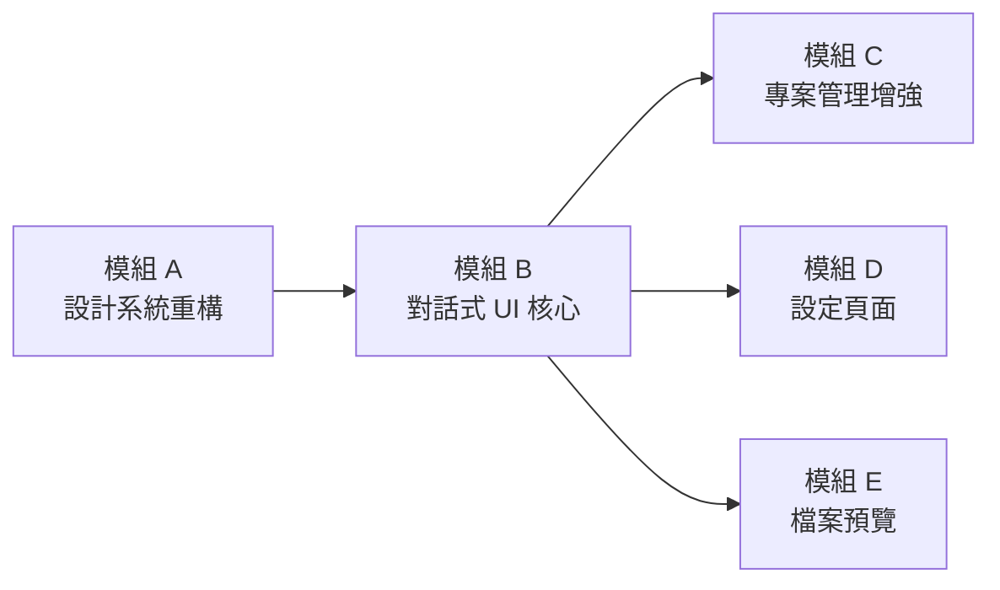

# Phase 4：前端介面開發與系統整合 — 最終實作紀錄

> **當前狀態：** ✅ 已完工 (2026-05-10)
> **總結：** 本階段成功將 Phase 3 的 Agent 引擎轉化為具備「生產級 UI」、「即時串流」、「對話持久化」與「自動文件產出」的完整平台。

---

## 核心技術突破 (Key Achievements)

### 1. 多執行緒與 Event Loop 同步
在實作過程中，我們克服了 CrewAI 背景執行緒與 FastAPI 非同步事件迴圈的衝突，透過 `session.enqueue_sse_event_sync` 實現了穩定的 SSE 推播。

### 2. 對話歷史持久化 (Persistence)
超越了原計畫「僅在前端保留」的初衷，實作了後端 SQLite 資料庫存儲，確保專案切換或系統重啟後，對話歷史依然完整存在。

### 3. 自動化產出落盤
成功實現了四個階段的 Markdown 規格書自動生成，並精確管理於 `backend/docs/` 目錄。

---

## Resolved Open Questions

1. **專案建立流程**：採用了更嚴謹的流程，確保專案名稱與描述在初始化時即正確建立。
2. **對話歷史持久化**：**已實作後端存儲**。這是本階段最重要的功能提升，支援專案間切換與歷史回溯。
3. **路徑管理**：最終採用相對於後端目錄的 `docs/` 資料夾，解決了絕對路徑可能導致的環境相依問題。


---

## Proposed Changes

Phase 4 分為 **五個開發模組**，依相依性排序開發：

---

### 模組 A：設計系統重構（Design System Overhaul）

> 修正目前 `index.css` 中遺留的 Vite 模板殘留樣式，建立完整的 design tokens 體系，為所有新元件提供一致的視覺基礎。

#### [MODIFY] [index.css](file:///Users/kennykang/Desktop/VibeProj/spec-forge-ai/frontend/src/index.css)

- **移除遺留樣式**：刪除 `#root` 的 `width: 1126px`、`text-align: center`、`border-inline` 等 Vite 模板殘留規則
- **移除未使用的 CSS 變數**：清除 `--text`, `--text-h`, `--bg`, `--border`, `--code-bg`, `--accent` 等與暗色主題衝突的淺色變數
- **新增 design tokens**：
  - 色彩：Agent 角色色 (`--agent-ba`, `--agent-pm`, `--agent-architect`, `--agent-writer`)
  - 間距：統一間距系統 (`--space-xs` ~ `--space-xl`)
  - 動畫：`--transition-fast`, `--transition-normal`
  - 圓角：`--radius-sm`, `--radius-md`, `--radius-lg`
  - Z-index 層級規範
- **新增全域動畫**：
  - `@keyframes fadeInUp` — 訊息泡泡進場
  - `@keyframes pulse` — Agent 思考中脈衝
  - `@keyframes slideInLeft` / `slideInRight` — 側面板滑入
- **新增 scrollbar 美化**：暗色主題的自訂捲軸

---

### 模組 B：對話式 UI 核心（Chat Experience）

> 這是 Phase 4 的**核心模組**。將目前的 `ChatArea.jsx` 骨架重構為完整的多元件對話系統，處理所有 SSE 事件並實現 Human-in-the-Loop 互動。

#### [NEW] [chatStore.js](file:///Users/kennykang/Desktop/VibeProj/spec-forge-ai/frontend/src/stores/chatStore.js)

新增專門的對話狀態管理 store：

```
state: {
  messages: [],          // { id, role, agent, content, timestamp, type }
  uiState: 'IDLE',      // IDLE | AGENT_THINKING | WAITING_USER_INPUT | STREAMING_DOC | ERROR
  currentAgent: null,    // 'BA' | 'PM' | 'Architect' | 'Writer'
  currentPhase: 1,       // 1-5 目前階段
  isWorkflowStarted: false,
  error: null,
}
actions: {
  addMessage(),
  setUIState(),
  setCurrentAgent(),
  advancePhase(),
  clearMessages(),
}
```

#### [MODIFY] [ChatArea.jsx](file:///Users/kennykang/Desktop/VibeProj/spec-forge-ai/frontend/src/components/Chat/ChatArea.jsx)

全面重構為容器元件（Container Component），職責：
- 管理 SSE 連線生命週期
- **解析所有 SSE 事件類型**：
  - `agent_question` → 新增 Agent 訊息氣泡 + 切換到 `WAITING_USER_INPUT` 狀態
  - `agent_message` → 新增 Agent 一般訊息
  - `phase_complete` → 更新階段進度 + 通知
  - `error` → 顯示錯誤提示
- 呼叫 `POST /api/projects/:id/start` 啟動 workflow
- 呼叫 `POST /api/projects/:id/reply` 送出使用者回覆
- 組合渲染子元件（MessageList、ChatInput、PhaseProgress）

#### [NEW] [MessageList.jsx](file:///Users/kennykang/Desktop/VibeProj/spec-forge-ai/frontend/src/components/Chat/MessageList.jsx)

訊息列表元件：
- 自動滾動到底部（新訊息時）
- 渲染 `MessageBubble` 陣列
- 空狀態（歡迎畫面 + 「開始對話」按鈕）

#### [NEW] [MessageBubble.jsx](file:///Users/kennykang/Desktop/VibeProj/spec-forge-ai/frontend/src/components/Chat/MessageBubble.jsx)

單一訊息氣泡元件：
- **Agent 訊息（左側）**：帶 Agent 角色頭像 + 名稱標籤 + 角色色條紋
- **使用者訊息（右側）**：使用者氣泡
- **Markdown 渲染**：使用 `react-markdown` + `remark-gfm` + `react-syntax-highlighter` 渲染 Agent 的回覆（支援程式碼區塊、表格、Mermaid 圖表預留）
- 進場動畫（fadeInUp）

#### [NEW] [TypingIndicator.jsx](file:///Users/kennykang/Desktop/VibeProj/spec-forge-ai/frontend/src/components/Chat/TypingIndicator.jsx)

Agent 思考中指示器：
- 顯示當前 Agent 角色名稱 + 脈衝動畫
- 在 `AGENT_THINKING` 狀態時顯示

#### [NEW] [ChatInput.jsx](file:///Users/kennykang/Desktop/VibeProj/spec-forge-ai/frontend/src/components/Chat/ChatInput.jsx)

輸入區塊元件（從 ChatArea 中抽離）：
- Textarea 自動高度調整
- Enter 送出 / Shift+Enter 換行
- 根據 UI 狀態控制禁用/啟用
- 送出按鈕帶 loading 狀態
- `WAITING_USER_INPUT` 狀態時顯示高亮邊框提示「Agent 正在等待您的回覆」

#### [NEW] [PhaseProgress.jsx](file:///Users/kennykang/Desktop/VibeProj/spec-forge-ai/frontend/src/components/Chat/PhaseProgress.jsx)

五階段流程進度條（固定在 Chat Header 區域）：
- 5 個步驟：🔍 意圖挖掘 → 📋 需求提案 → 🏗️ 技術架構 → 📝 規格收斂 → ✅ 品質保證
- 已完成步驟：填滿色 + 勾號
- 進行中步驟：脈衝動畫 + 當前 Agent 名稱
- 未開始步驟：灰色虛線

#### [NEW] [Chat.css](file:///Users/kennykang/Desktop/VibeProj/spec-forge-ai/frontend/src/components/Chat/Chat.css)

對話相關所有樣式，從 `Layout.css` 中遷移並大幅擴充：
- 訊息氣泡（Agent 左 / User 右）
- Agent 角色顏色系統（BA=紫、PM=藍、Architect=綠、Writer=橘）
- Markdown 渲染內嵌樣式
- 思考動畫
- 進度條
- 響應式調整

#### [NEW] [useSSE.js](file:///Users/kennykang/Desktop/VibeProj/spec-forge-ai/frontend/src/hooks/useSSE.js)

將 SSE 連線邏輯從 ChatArea 抽離為獨立 hook：
- 接收 `projectId` 與 `token`
- 自動管理連線/斷線生命週期
- 解析各種事件類型並更新 `chatStore`
- 暴露 `connectionStatus` 與 `reconnect()` 方法
- 新增 `agent_message` 事件監聽（目前 `sseClient.js` 只監聽 `connected` 和 `heartbeat`）

#### [MODIFY] [sseClient.js](file:///Users/kennykang/Desktop/VibeProj/spec-forge-ai/frontend/src/services/sseClient.js)

擴充事件監聽：
- 新增 `agent_question`、`agent_message`、`phase_complete`、`error` 事件監聽
- 改善重連邏輯（指數退避 + jitter）

---

### 模組 C：專案管理增強（Project Management）

> 增強側邊欄操作能力與新增專案詳情頁面。

#### [MODIFY] [Sidebar.jsx](file:///Users/kennykang/Desktop/VibeProj/spec-forge-ai/frontend/src/components/Layout/Sidebar.jsx)

- 將 `prompt()` 替換為內嵌的新專案表單（或 Modal，視 Open Question #1 的回覆）
- 專案項目增加右鍵選單 / hover 操作按鈕（刪除、重新命名）
- 專案項目顯示狀態標籤（`created` / `in_progress` / `completed`）
- 側邊欄底部增加「⚙️ 設定」按鈕，導向設定頁面

#### [NEW] [CreateProjectModal.jsx](file:///Users/kennykang/Desktop/VibeProj/spec-forge-ai/frontend/src/components/Project/CreateProjectModal.jsx)

專案建立模態框：
- 專案名稱（必填）
- 專案描述（選填）
- 確認 / 取消按鈕
- glassmorphism 樣式

#### [NEW] [ProjectVersions.jsx](file:///Users/kennykang/Desktop/VibeProj/spec-forge-ai/frontend/src/components/Project/ProjectVersions.jsx)

版本歷程面板（右側可展開面板或子頁面）：
- 呼叫 `GET /api/projects/:id/versions`
- 時間軸式排列各版本
- 顯示 version_tag、change_summary、created_at

#### [NEW] [Project.css](file:///Users/kennykang/Desktop/VibeProj/spec-forge-ai/frontend/src/components/Project/Project.css)

專案管理相關樣式

#### [MODIFY] [App.jsx](file:///Users/kennykang/Desktop/VibeProj/spec-forge-ai/frontend/src/App.jsx)

新增路由：
```jsx
<Route path="/dashboard" element={<Dashboard />} />
<Route path="/projects/:id" element={<ProjectDetail />} />
<Route path="/settings" element={<SettingsPage />} />
```

---

### 模組 D：設定頁面（Settings）

> 實現 LLM 供應商切換與 SKILL 對答問題自訂的管理介面。

#### [NEW] [SettingsPage.jsx](file:///Users/kennykang/Desktop/VibeProj/spec-forge-ai/frontend/src/pages/SettingsPage.jsx)

設定頁面容器：Tab 切換兩個子面板

#### [NEW] [LLMSettings.jsx](file:///Users/kennykang/Desktop/VibeProj/spec-forge-ai/frontend/src/components/Settings/LLMSettings.jsx)

LLM 供應商設定面板：
- 供應商選擇下拉選單（Ollama / OpenAI / Google / OpenRouter / Nvidia / Custom）
- 模型名稱輸入
- API Key 輸入（密碼遮罩 + 切換顯示）
- Base URL 輸入（Custom / Ollama 時顯示）
- 儲存按鈕 → 呼叫 `PUT /api/settings/llm`
- 載入現有設定 → `GET /api/settings/llm`

#### [NEW] [SkillSettings.jsx](file:///Users/kennykang/Desktop/VibeProj/spec-forge-ai/frontend/src/components/Settings/SkillSettings.jsx)

SKILL 對答設定面板：
- 展開/收合各 SKILL（SKILL-01 ~ SKILL-04）
- 顯示預設問題清單
- 支援新增/編輯/刪除自訂問題
- 最大提問輪次調整（number input）
- 儲存按鈕 → 呼叫 `PUT /api/settings/skills/:name`

#### [NEW] [Settings.css](file:///Users/kennykang/Desktop/VibeProj/spec-forge-ai/frontend/src/components/Settings/Settings.css)

設定頁面樣式（表單、Tab、卡片等）

---

### 模組 E：檔案預覽與下載（File Preview & Download）

> 提供規格文件的線上預覽與下載功能。

#### [NEW] [FilePanel.jsx](file:///Users/kennykang/Desktop/VibeProj/spec-forge-ai/frontend/src/components/Files/FilePanel.jsx)

檔案面板（Chat 右側可展開的側面板）：
- 呼叫 `GET /api/projects/:id/files`（待後端實作，先用 mock）
- 列出所有產出檔案（intent_report.md, proposal.md, design_and_tasks.md, final_specs.md）
- 點擊單一檔案 → 開啟預覽
- 下載全部按鈕 → 呼叫 `GET /api/projects/:id/download`（待後端實作）

#### [NEW] [FilePreview.jsx](file:///Users/kennykang/Desktop/VibeProj/spec-forge-ai/frontend/src/components/Files/FilePreview.jsx)

檔案預覽模態框：
- Markdown 全螢幕渲染
- 支援程式碼高亮
- 複製全文按鈕
- 關閉按鈕

#### [NEW] [Files.css](file:///Users/kennykang/Desktop/VibeProj/spec-forge-ai/frontend/src/components/Files/Files.css)

檔案面板與預覽樣式

---

## 新增檔案總覽

```
frontend/src/
├── components/
│   ├── Chat/
│   │   ├── ChatArea.jsx          [MODIFY] 重構為容器元件
│   │   ├── Chat.css              [NEW]
│   │   ├── MessageList.jsx       [NEW]
│   │   ├── MessageBubble.jsx     [NEW]
│   │   ├── TypingIndicator.jsx   [NEW]
│   │   ├── ChatInput.jsx         [NEW]
│   │   └── PhaseProgress.jsx     [NEW]
│   ├── Project/
│   │   ├── CreateProjectModal.jsx [NEW]
│   │   ├── ProjectVersions.jsx   [NEW]
│   │   └── Project.css           [NEW]
│   ├── Settings/
│   │   ├── LLMSettings.jsx       [NEW]
│   │   ├── SkillSettings.jsx     [NEW]
│   │   └── Settings.css          [NEW]
│   ├── Files/
│   │   ├── FilePanel.jsx         [NEW]
│   │   ├── FilePreview.jsx       [NEW]
│   │   └── Files.css             [NEW]
│   └── Layout/
│       ├── Sidebar.jsx           [MODIFY]
│       └── Layout.css            [MODIFY] 移出 chat 樣式
├── hooks/
│   ├── useApi.js                 (不變)
│   └── useSSE.js                 [NEW]
├── pages/
│   ├── Dashboard.jsx             [MODIFY]
│   └── SettingsPage.jsx          [NEW]
├── services/
│   └── sseClient.js              [MODIFY]
├── stores/
│   ├── authStore.js              (不變)
│   ├── projectStore.js           (不變)
│   └── chatStore.js              [NEW]
├── App.jsx                       [MODIFY]
└── index.css                     [MODIFY]
```

> 合計：**15 個新檔案** + **6 個修改檔案**

---

## Verification Plan

### Automated Tests

1. **前端編譯驗證**
   ```bash
   cd frontend && npm run build
   ```
   確保零錯誤零警告

2. **瀏覽器整合測試**（使用 browser 工具）
   - 登入流程 → 進入 Dashboard
   - 建立新專案 → 確認出現在側邊欄
   - 選取專案 → 確認 Chat 區塊正確渲染
   - 確認空狀態歡迎畫面
   - 確認設定頁面可切換 Tab 並顯示表單
   - 確認 UI 各元件的 glassmorphism 視覺效果

### Manual Verification

- **端對端流程測試**：啟動後端 + 前端 → 登入 → 建專案 → 啟動 workflow → 觀察 SSE 事件在 UI 上的即時渲染 → 回覆 Agent 問題 → 觀察對話持續進行
- 請使用者確認視覺風格與互動體驗符合預期

---

## 開發順序



| 順序 | 模組 | 預估工時 | 說明 |
|------|------|---------|------|
| 1 | A — 設計系統 | ⬛⬛ | 所有元件的視覺基礎，必須最先完成 |
| 2 | B — 對話式 UI | ⬛⬛⬛⬛⬛ | Phase 4 核心，工作量最大 |
| 3 | C — 專案管理 | ⬛⬛ | 依賴模組 B 的路由結構 |
| 4 | D — 設定頁面 | ⬛⬛ | 獨立頁面，可與 C 並行 |
| 5 | E — 檔案預覽 | ⬛ | 後端 API 未完成，先做 UI 骨架 |
