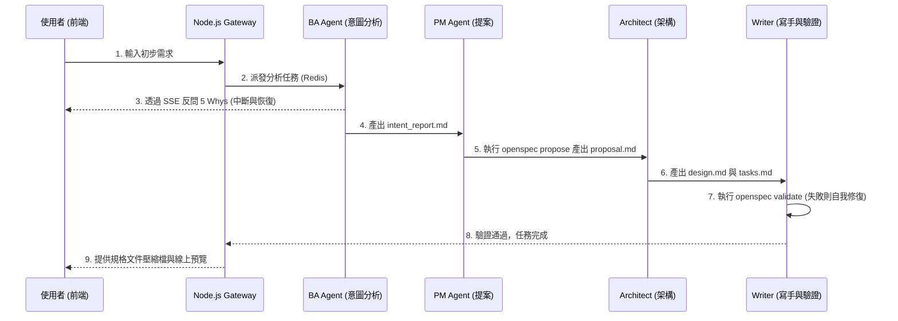
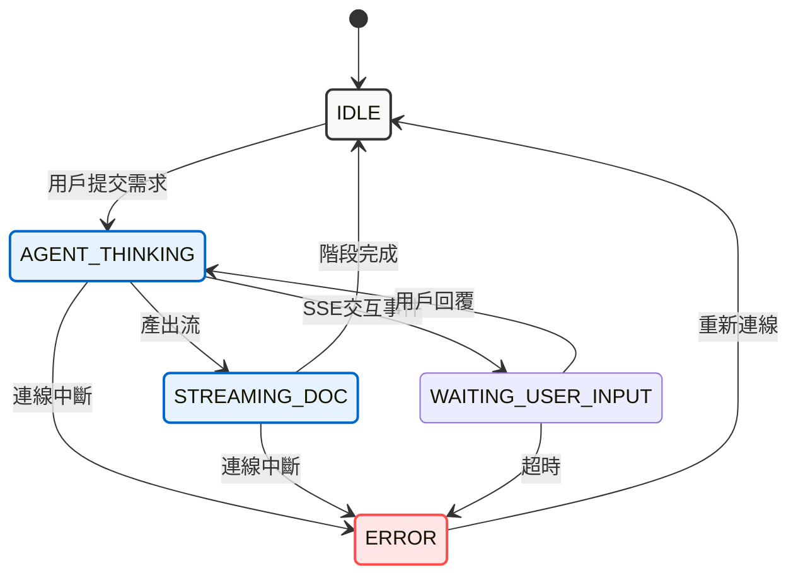

# 軟體開發需求與系統架構計畫書 (PRD) v1.1

## **1\. 專案願景**

打造一個智慧化的 AI 軟體工程顧問平台。系統不只是單向接收需求，而是透過多智能體（Multi-Agent）協作，主動挖掘使用者的真實商業意圖，並最終產出符合 OpenSpec 規範的工業級規格文件。

## **2\. 系統核心流程 (The Pipeline)**

本系統將開發流程劃分為五個關鍵階段，每個階段由專屬 Agent 負責：

1. **意圖挖掘 (Intent Discovery):** BA Agent 透過 5 Whys 提問釐清深層痛點。  
2. **需求提案 (Requirement Proposal):** PM Agent 彙整意圖並執行 openspec propose。  
3. **技術架構 (Technical Design):** Architect Agent 進行技術選型與開發任務拆解。  
4. **規格收斂 (Spec Finalization):** Technical Writer Agent 彙整所有文件。  
5. **品質保證 (QA & Validation):** 技術寫手執行 openspec validate 並進行自動修復。

### 多智能體工作流 (Multi-Agent Workflow) 的文檔圖表


## **3. 多智能體角色定義 (Agent Roles)**

| 角色 | 職責 (Responsibilities) | 關鍵工具 (Tools) | 產出檔案 |
| :---- | :---- | :---- | :---- |
| **BA (商業分析師)** | 挖掘需求意圖，防止 XY 問題，確認商業價值。 | 5 Whys 思考框架 | intent\_report.md |
| **PM (產品經理)** | 功能盤點、語言選擇確認。 | openspec propose | proposal.md |
| **Architect (架構師)** | 技術架構設計、任務分解、硬體環境評估。 | Mermaid 繪圖、技術知識庫 | design.md, tasks.md |
| **Writer (技術寫手)** | 文件撰寫、Markdown 格式標準化。 | file\_writer, openspec validate | specs/\*.md |

## **4\. 技術架構與部署實作**

### **4.1 微服務架構 (Microservices)**

* **Node.js API Gateway:** 負責 JWT 認證、資料庫管理、專案目錄建立、SSE 狀態推播。  
* **Redis Pub/Sub:** 負責 Node.js 與 Python 之間的非同步任務傳遞與即時訊息回傳。  
* **Python Agent Worker:** 執行 CrewAI 流程，並透過 subprocess 驅動 OpenSpec CLI。

### **4.2 檔案與儲存管理**

* **工作區隔離:** 使用 /tmp/workspace\_{projectId} 作為運算沙盒。  
* **本地同步:** 任務結束後將 Markdown 檔案同步至 ./data/projects/{projectId}/。  
* **版本控制:** 採用 OpenSpec 的 changes/ 與 specs/ 結構，實現規格即程式碼 (Spec-as-Code)。

## **5. 前端互動狀態機 (Frontend State Machine)**

前端 UI 必須精確反應後端 Agent 的狀態，確保對話的連貫性與系統的安全性。

### **5.1 狀態轉移圖**



--- 


## **6\. 後續開發里程碑**

1. **環境搭建:** 安裝 Redis, Node.js, Python, 與全域 OpenSpec CLI。  
2. **通訊協定實作:** 完成 Node.js 推送任務至 Redis 與 Python Worker 監聽邏輯。  
3. **Agent 邏輯開發:** 撰寫具備 5 Whys 策略與 openspec CLI 調用能力的 Python Tools。  
4. **前端介面整合:** 使用 @microsoft/fetch-event-source 實作支援 JWT 的 SSE 監聽器與 Markdown 渲染器。

---

## **7. 專案初始化與部署**

### **7.1 推薦配置**

本項目採用 **spec-forge-ai** 作為專案標識符。

---

### **7.2 初始化步驟**

使用以下終端機指令建立微服務 Monorepo 結構並初始化 Git 版控：

#### **Step 1: 建立根目錄與 Git 初始化**

首先，建立整個專案的專屬目錄，並進行 Git 與目錄規劃。

```bash
# 建立專案根目錄  
mkdir spec-forge-ai  
cd spec-forge-ai

# 初始化 Git 儲存庫  
git init

# 建立核心子目錄  
mkdir node_gateway    # Node.js API 伺服器  
mkdir python_worker   # Python CrewAI 引擎  
mkdir frontend        # React 前端介面  
mkdir data            # 永久儲存規格書的本地資料夾 (預先建立)
```

#### **Step 2: 建立根目錄的 .gitignore**

在微服務架構中，根目錄的 .gitignore 非常重要，它能避免你把肥大的模組或機密金鑰推送到 GitHub 上。

```bash
# 在根目錄建立 .gitignore 並寫入規則  
cat <<EOT >> .gitignore
# Node.js
node_modules/
npm-debug.log
.env

# Python
__pycache__/
*.py[cod]
*$py.class
.venv/
venv/
env/

# OS Files
.DS_Store

# 專案產出物
data/
/tmp/
EOT
```

#### **Step 3: 初始化 Node.js API Gateway**

進入後端目錄，初始化 npm 並安裝我們之前討論到的核心套件。

```bash
cd node_gateway

# 初始化 package.json  
npm init -y

# 安裝核心套件 (Express, Redis 通訊, JWT 等)  
npm install express ioredis jsonwebtoken cors uuid  
# 安裝開發用套件 (自動重啟)  
npm install nodemon --save-dev

# 建立後端進入點檔案  
touch api_gateway.js

# 退回根目錄  
cd ..
```

#### **Step 4: 初始化 Python CrewAI Worker**

進入 Python 目錄，建立虛擬環境 (Virtual Environment)，確保 Python 套件不會跟系統環境衝突。

```bash
cd python_worker

# 建立名為 .venv 的虛擬環境  
python3 -m venv .venv

# 啟動虛擬環境 (Mac/Linux)  
source .venv/bin/activate  
# (若是 Windows PowerShell 請使用: .venv\Scripts\Activate.ps1)

# 升級 pip  
pip install --upgrade pip

# 安裝核心套件 (CrewAI, Redis)  
pip install crewai redis python-dotenv pydantic

# 記錄當下安裝的套件版本到 requirements.txt  
pip freeze > requirements.txt

# 建立 Worker 進入點檔案  
touch crew_worker.py  
touch agents.py  
touch tools.py

# 退回根目錄  
cd ..
```

#### **Step 5: 初始化 React 前端 (使用 Vite)**

我們使用目前最快、最主流的 Vite 來快速建立 React 專案。

```bash
# 使用 Vite 建立 React 專案 (選用 JavaScript 或 TypeScript 皆可，此處以 JS 為例)  
npm create vite@latest frontend -- --template react

cd frontend

# 安裝基本套件  
npm install

# 安裝我們之前討論到的 Zustand (狀態管理) 與 SSE 接收套件  
npm install zustand @microsoft/fetch-event-source react-markdown

# 退回根目錄  
cd ..
```

---

### **7.3 專案目錄結構**

初始化完成後，專案目錄結構如下：

```
spec-forge-ai/
├── .git/
├── .gitignore
├── data/                 # 預留給未來存放 OpenSpec Markdown 的地方
├── frontend/             # Vite + React (處理 UI 與 SSE)
│   ├── package.json
│   └── src/
├── node_gateway/         # Node.js + Express (處理 API, JWT, Redis 推播)
│   ├── package.json
│   └── api_gateway.js
└── python_worker/        # Python + CrewAI (處理 LLM 邏輯與 CLI 呼叫)
    ├── .venv/            # Python 虛擬環境
    ├── requirements.txt
    ├── agents.py
    ├── tools.py
    └── crew_worker.py
```

---

## **8. 後續部署步驟**

初始化完成後，需要進行以下配置與驗證：

1. **環境變數配置** - 建立各微服務的 .env 檔案
2. **Docker Compose 或 PM2 配置** - 設定本地或容器化部署
3. **Redis 連接測試** - 驗證 Node.js 與 Python Worker 的通訊
4. **OpenSpec CLI 驗證** - 確保全域安裝完成
5. **系統集成測試** - 端對端流程驗證